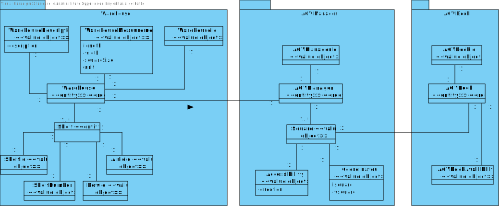
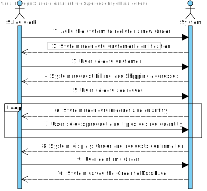
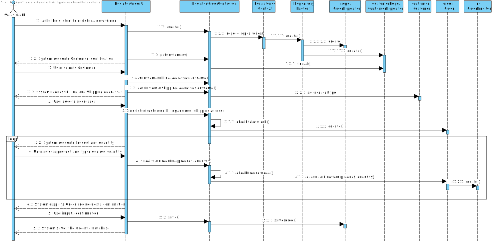
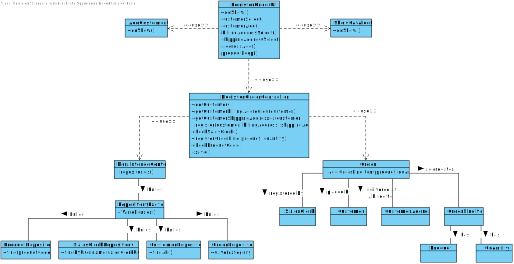

US1004
=======================================

# 1. Requisites

**As Sales Clerk, I want to create a new products order on behalf of a given customer.**

Acceptance Criteria:

- The order must be paid at the time of creation.

- The customer must be notified of the new order. 

Client Clarifications:

- **Q1:** Does the customer (client) need to have an address when creating? Or initially this field may be empty and only need address when it requests a purchase.

    **A:** Regarding customers, the minimum required information is its name, a valid Value-Added Tax (VAT) identifier, an email address, and a phone number.

- **Q2:** How will the customer pay for the order placed by the clerk. Will receive a notification?

  **A:** For now, you may assume the clerk selects one of the available payment methods and types the required information. Yet, I would like to emphasise what is stated in the specifications document:

  *"While developing the system prototype, these two issues (i.e.: shipment and payment) must be considered. Although, since both are not perceived as representing a risk to the project, the shipment cost computation, and the connections to external systems (e.g.: carriers and payment services) should be mock."* 

- **Q3:** After placing the order will the system notify the customer? If so, how?

  **A:** That is a good idea... the system might send a notification email to the customer. This functionality will be seen as an asset to distinguish the solutions presented by different development teams.

- **Q4:** How do you want the clerk to select the products? By putting their id or selecting?

  **A:** Both: by typing the product id when knowing it or by using searching/browsing the products catalog (US1002).

- **Q5:** when a sales clerk creates a new order for a given customer, does the customer need to be registered in the system?

  **A:** Most of the times, the customer is already registered. However, it might happen (s)he is not registered. In such case, the customer is registered on that moment using US1003.

# 2. Analysis

## 2.1 Domain Diagram

These are the domain entities that are going to be used by this function.

## 2.2 System Sequence Diagram

This section presents the simple flow of the sequence of events.

# 3. Design

## 3.1. Sequence Diagram

## 3.2. Class Diagram

## 3.3. Applied Patterns

For the realization of this user story The team used an OOP approach taking into the account of the use of a persistence context through jpa.

## 3.4. Tests

**Test 1:** Verify that an exception is thrown when an Order is created in an invalid state.

    assertThrows(IllegalArgumentException.class, () -> {
        new Order(testCustomer, testShippingAddress, testBillingAddress);
    });
    assertThrows(IllegalArgumentException.class, () -> {
        new Order(null, testBillingAddress, testShippingAddress);
    });
    assertThrows(IllegalArgumentException.class, () -> {
        new Order(testCustomer, null, null);
    });

**Test 2:** Verify that a valid OrderLineItem is able to be added to an Order.
    
    Order order = new Order(testCustomer, testBillingAddress, testShippingAddress);
  
    Product product1 = generateDummyProduct(1);
    Quantity quantity1 = Quantity.valueOf(2);
  
    String line1 = order.addOrderLineItem(product1, quantity1).toString();
    String expected1 = "LINE NO: 1 |  PRODUCT: testShortDescription1 - testLongDescription1 | testBrand1\n" +
            "Ref.: ABCD.00001 / testReferenceCode1 | PVP 1,50\u00a0€ (1,85\u00a0€ w/Tax)  |  QTY: 2  |  TOTAL: 3,00\u00a0€";
  
    assertEquals(line1, expected1);
    
    (...)
    
    assertEquals(order.numberOfLines(), 2);

**Test 3:** Verify that an exception is thrown when an OrderLineItem is created in an invalid state.

    assertThrows(IllegalArgumentException.class, () -> {
        OrderLineItem item4 = new OrderLineItem(-1, generateDummyProduct(1));
    });
    assertThrows(IllegalArgumentException.class, () -> {
        OrderLineItem item5 = new OrderLineItem(1, null);
    });
    assertThrows(IllegalArgumentException.class, () -> {
        OrderLineItem item6 = new OrderLineItem(1, generateDummyProduct(1), null);
    });

# 4. Implementation

**Class conformity** 

***Order***

    @Entity
    @Table(name = "Customer_Order")
    public class Order implements AggregateRoot<Long> {
        @Id
        @GeneratedValue(strategy = GenerationType.AUTO)
        @Column(nullable = false)
        private Long id;
    
        @ManyToOne(fetch = FetchType.LAZY)
        @JoinColumns({
                @JoinColumn(name = "salesClerk_id", referencedColumnName = "id")
        })
        private SalesClerk salesClerk;
    
        @ManyToOne(fetch = FetchType.LAZY)
        @JoinColumns({
                @JoinColumn(name = "customer_id", referencedColumnName = "identifier")
        })
        private Customer customer;
    
        @OneToOne(cascade = CascadeType.ALL)
        @JoinColumns({
                @JoinColumn(name = "shipment_id", referencedColumnName = "identifier")
        })
        private Shipment shipment;
    
        @OneToOne(cascade = CascadeType.ALL)
        @JoinColumns({
                @JoinColumn(name = "payment_id", referencedColumnName = "identifier")
        })
        private Payment payment;

***OrderLineItem***

    @Entity
    public class OrderLineItem implements DomainEntity<Long> {
        @Id
        @GeneratedValue(strategy = GenerationType.AUTO)
        @Column(nullable = false)
        private Long id;
    
        private int lineNo;
    
        @Transient
        private Product product;
    
        @Embedded
        @AttributeOverrides({
                @AttributeOverride(name = "shortDescription.description", column = @Column(name = "product_shortDescription")),
                @AttributeOverride(name = "longDescription.description", column = @Column(name = "product_longDescription")),
                @AttributeOverride(name = "technicalDescription.description", column = @Column(name = "product_technicalDescription")),
        })
        private ProductDescriptions productDescriptions;
    
        @Embedded
        @AttributeOverrides({
                @AttributeOverride(name = "amount", column = @Column(name = "product_price_amount")),
                @AttributeOverride(name = "currency", column = @Column(name = "product_price_currency"))
        })
        private Money productPrice;
    
        @Embedded
        private Quantity quantity;
    
        @Embedded
        @AttributeOverrides({
                @AttributeOverride(name = "amount", column = @Column(name = "total_amount")),
                @AttributeOverride(name = "currency", column = @Column(name = "total_currency"))
        })
        private Money total;

***RegisterOrderController***

    public class RegisterOrderController {
    
        (...)
    
         /**
         * Registers a new Order in the system
         *
         * @param customer        the selected customer
         * @param billingAddress  the selected billing address
         * @param shippingAddress the selected shipping address
         * @return an empty Order
         */
        public Order register(Customer customer, CustomerAddress billingAddress, CustomerAddress shippingAddress) {
            SalesClerk salesClerk = checkSalesClerk();
    
            return (this.order = new Order(salesClerk, customer, billingAddress, shippingAddress));
        }
    
        public OrderLineItem registerOrderLine(String selectedProduct, int quantity) {
            return order.addOrderLineItem(checkProductCode(selectedProduct), Quantity.valueOf(quantity));
        }
    
        public Order save() {
            return repo.save(order);
        }
        
        (...)

    }

# 5. Integration/Demonstration

In order to integrate this US with the system at hand there was a need to create two classes of persistence so that it can be done through either a server or in memory.
Also, The UI was done in way that it can be easily implemented with other user should that need come.

# 6. Observations

This US is still in early development and will be improved in further sprints, namely with the development of features such as:
- Payment System mocking
- Shipment System mocking
- Order State control and switching

