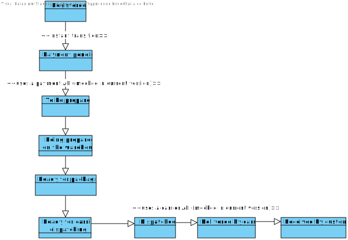
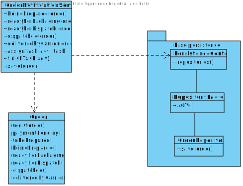

US1007
=======================================

# 1. Requisites

**As Project Manager, I want the team to implement Order state transition validation tests.**

Acceptance Criteria:

- Valid order state transitions must be explicit.

- State transitions must be the responsability of a service class.

Client Clarifications:

**[Q1:](https://moodle.isep.ipp.pt/mod/forum/discuss.php?d=16863)** 
According to project specification, referring to an order, *"some possible states that can be considered are: (i) registered, (ii) payment pending, (iii) to be prepared (waiting for an initial warehouse action), (iv) being prepared on the warehouse, (v) ready for packaging; (vi) ready for carrier dispatching, (vii) dispatched, (viii) delivered by carrier, (ix) received by customer."*.
  Are all these states sequential or can they be reverted? (For example, can an order go from "being prepared on the warehouse" back to "to be prepared" due to an AGV error? In what other states can this happen?)

**A:** The scenario you describe can happen.
However, for Sprint C it is not worth to consider it.

# 2. Analysis

## 2.1 Domain Diagram

These are the domain entities that are going to be used by this function.

- Order

[Domain Diagram](../Domain Diagram/Domain Diagram.svg)

The valid order state transitions are described in the following diagram.

# 3. Design

## 3.1 Class Diagram

## 3. Tests

**Test 1: Skipping transition states** 

Verify that an exception is thrown when an Order in *Payment Pending* state transitions to *Being Prepared*.

    @Test
    void testPaymentPendingToBeingPreparedInvalid() {
        //Order in state PAYMENT_PENDING
        Order order = new Order(testSalesClerk, testCustomer, testBillingAddress, testShippingAddress, testShippingMethod, testPaymentMethod, testOrderLineItems);

        assertThrows(IllegalStateException.class, order::beingPrepared);
    }

**Test 2: Going back to a previous state** 

Verify that an exception is thrown when an Order in *Ready For Packaging* transitions to *Being Prepared*

    @Test
    void testReadyForPackagingToBeingPreparedInvalid() {
        //Order in state READY_FOR_PACKAGING
        Order order = new Order(testSalesClerk, testCustomer, testBillingAddress, testShippingAddress, testShippingMethod, testPaymentMethod, testOrderLineItems);
        order.addPaymentConfirmation(PaymentConfirmation.valueOf(true, RegisterTime.now(), "Payment successful"));
        order.beingPrepared();
        order.readyForPackaging();

        assertThrows(IllegalStateException.class, order::beingPrepared);
    }

**Test 3: Transitioning to the current state** 

Verify that an exception is thrown when an Order in *Ready For Packaging* transitions to *Ready For Packaging*
    
    @Test
    void testReadyForPackagingToReadyForPackagingInvalid() {
        //Order in state READY_FOR_PACKAGING
        Order order = new Order(testSalesClerk, testCustomer, testBillingAddress, testShippingAddress, testShippingMethod, testPaymentMethod, testOrderLineItems);
        order.addPaymentConfirmation(PaymentConfirmation.valueOf(true, RegisterTime.now(), "Payment successful"));
        order.beingPrepared();
        order.readyForPackaging();

        assertThrows(IllegalStateException.class, order::readyForPackaging);
    }