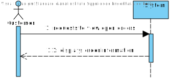
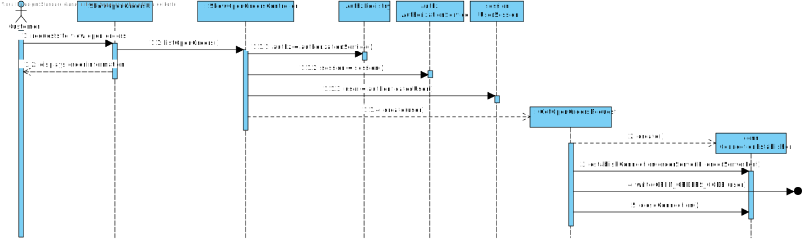
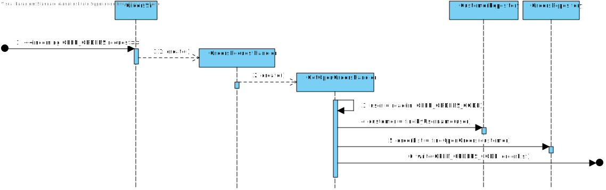
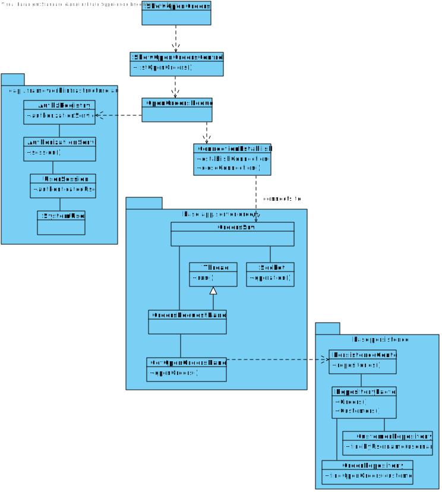

# US1502
=======================================

# 1. Requisites

**US1502** As Customer, I want to view/check the status of my open orders.

### Acceptance Criteria:

- Must communicate with Orders Server
- All order states must be displayed except "Received by customer"

# 2. Analysis

## 2.1 Domain Diagram

This user story will be using the following Aggregates:

- Order

[(Domain Diagram)](../../Domain%20Diagram)

## 2.2 System Sequence Diagram

# 3. Design

## 3.1. Sequence Diagram

This Sequence Diagram has the purpose to go deeper in the flow of events of this user story, showing where the responsibilities to do what lie.

## 3.2. Class Diagram

This Diagram complements the Sequence Diagram showed before, highlighting the existing relations between the different classes

## 3.3. Applied Patterns

For the realization of this user story the team used an OOP approach taking into the account of the use of a persistence context through JPA.

## 3.4. Tests

**Test 1:** Verify that closed orders are not listed.

**Test 2:** Verify that the number of displayed orders is the same as the number of open orders on the database.

**Test 3:** Verify that fetching data from a customer with no open orders does not throw an error.

# 4. Implementation

**getOpenOrders method on RequestHandler (pseudo-code)**

    //Get user from request packet data
    user = readObject(socketInput)
    
    //Get customer from user info
    customer = customerRepo.findByUsername(user.username())

    //Get list of orders from database, belonging to given customer
    return orderRepo.findOpenOrders(customer)

**findOpenOrders method as database query (pseudo-code)**

    SELECT o FROM Order o
    WHERE o.customer.id = :customerId
    AND 
        (SELECT s.state FROM o.orderStates WHERE s.registerTime IN 
            (SELECT MAX(s2.registerTime) FROM o.orderStates s2)) 
        NOT LIKE "RECEIVED BY CUSTOMER"

# 5. Integration/Demonstration

In order to integrate this US with the system, a connection to the Orders server must be used. Therefore the command run-orderssrv must be run before starting the execution of this user story.

# 6. Observations

This user story was implemented using mostly existing application infrastructure. The only modifications to the code base were the UI, controller and server request class.