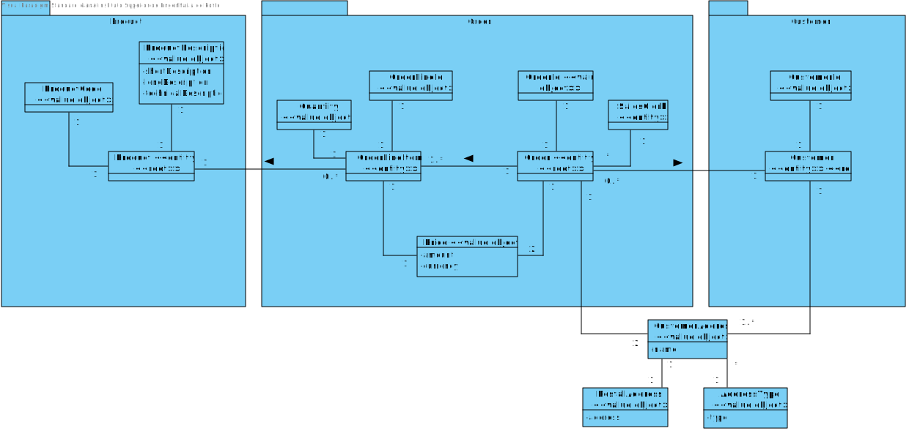
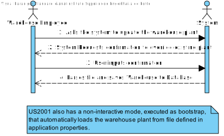
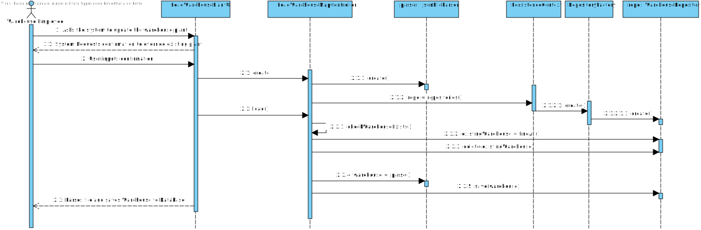
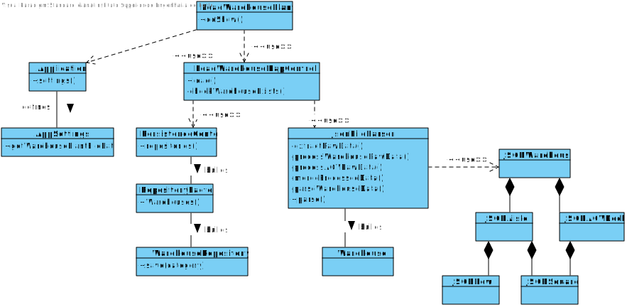

US2001
=======================================

# 1. Requisites

**As Warehouse Employee, I want to set up the warehouse plant by uploading a JSON file.**

Acceptance Criteria:

- A pre-defined JSON file can be automatically upload (e.g. at application start-up) to get a default warehouse plant and avoiding the employee to execute this action.

- The JSON file must follow the structure present in [configfiles](../../../configfiles/warehouse1.json).

Client Clarifications:

- [A1](https://moodle.isep.ipp.pt/mod/forum/discuss.php?d=15781#p20282): The purpose of uploading a JSON file (US2001) is to set up the warehouse plant information required to the system work properly.
Once that information is set up, there is no need to repeat the set up process. As so, if a JSON file is found the user might be prompt if (s)he wants to update the information about the warehouse plant. The user might also update the information by re-executing the US2001.
Yet, it is worth noticing that the JSON file might not be available on all workstations used by warehouse employees.
As so, persisting warehouse plant data on the database seems to be a good option.

- [A2](https://moodle.isep.ipp.pt/mod/forum/discuss.php?d=15758#p20252):
You need to differentiate the shelves in each row of an aisle.
Recall that "The products’ location in the warehouse, which corresponds to a storage area i.e., the aisle identifier, the row identifier, and the shelf identifier. All these identifiers are numeric."
As you have noticed, each row states how many shelves it has. As so, if a row states it has 4 shelves, it means that the row shelves are identified as shelf 1, 2, 3 and 4 from the bottom to the top.
If another row stated it has 3 shelves, it means that such row shelves are identified as shelf 1, 2 and 3 again from the bottom to the top.

# 2. Analysis

## 2.1 Domain Diagram

These are the domain entities that are going to be used by this function.

## 2.2 System Sequence Diagram

This section presents the simple flow of the sequence of events.

# 3. Design

## 3.1. Sequence Diagram

## 3.2. Class Diagram

## 3.3. Applied Patterns

For the realization of this user story The team used an OOP approach taking into the account of the use of a persistence context through jpa.

## 3.4. Tests

**Test 1:** Verify that an exception is thrown when a JSON file is not present.

    @Test
    void testFileNotFound() {
        JsonFileParser fileParser = new JsonFileParser("none");
        assertThrows(IOException.class, fileParser::parse);
    }
**Test 2:** Verify that an exception is thrown when a JSON file has incomplete information (i.e. missing aisles, rows or shelves).
    
    @Test
    void testFileIncomplete() {
        JsonFileParser fileParser1 = new JsonFileParser("src/test/java/eapli/base/warehousemanagement/application/JsonFileParserTestFiles/test_warehouse_incomplete_noRows.json");
        assertThrows(IllegalArgumentException.class, fileParser1::parse);

        JsonFileParser fileParser2 = new JsonFileParser("src/test/java/eapli/base/warehousemanagement/application/JsonFileParserTestFiles/test_warehouse_incomplete_noShelves.json");
        assertThrows(IllegalArgumentException.class, fileParser2::parse);

        JsonFileParser fileParser3 = new JsonFileParser("src/test/java/eapli/base/warehousemanagement/application/JsonFileParserTestFiles/test_warehouse_incomplete_noAisles.json");
        assertThrows(IllegalArgumentException.class, fileParser3::parse);
    }

**Test 3:** Verify that a valid JSON file can be parsed and converted to a Warehouse object.

    @Test
    void testFileComplete() throws IOException {
        JsonFileParser fileParser1 = new JsonFileParser("src/test/java/eapli/base/warehousemanagement/application/JsonFileParserTestFiles/test_warehouse_complete.json");
        Warehouse parsedWarehouse1 = fileParser1.parse();

        assertNotNull(parsedWarehouse1);

        assertEquals(parsedWarehouse1.description(), Description.valueOf("Warehouse Example 1"));
        assertEquals(parsedWarehouse1.length(), Length.valueOf(800));
        assertEquals(parsedWarehouse1.width(), Width.valueOf(720));
        assertEquals(parsedWarehouse1.squareSize(), SquareSize.valueOf(40));
        assertEquals(parsedWarehouse1.unit(), VolumeUnit.CM);
        assertEquals(parsedWarehouse1.shelves().size(), 61);

        assertNotNull(parsedWarehouse1.agvManager());
        assertEquals(parsedWarehouse1.agvManager().numberOfAGVDock(), 6);
    }

# 4. Implementation

**Class conformity** 

***JSONFileParser***

    public class JsonFileParser {
    
        private JSONWarehouse extractRawData() throws IOException {
            try {
                String fileContent = Files.textFrom(new FileInputStream(file));
                return parser.fromJson(fileContent, JSONWarehouse.class);
            } catch (JsonSyntaxException | IOException ex) {
                throw new IOException("Invalid format file!");
        }
    
        (...)

        public Warehouse parse() throws IOException {
            JSONWarehouse rawData = extractRawData();
            String warehouseProcessedData = processWarehouseRawData(rawData);
            String agvManagerProcessedData = processAGVRawData(rawData);
            String processedData = mergeProcessedData(warehouseProcessedData, agvManagerProcessedData);
            return parseWarehouseData(processedData);
        }
    }

***LoadWarehouseMapController***

    public class LoadWarehouseMapController {
    /**
     * Authorization service that is used to make sure only authorized users can use the controller
     */
    private final AuthorizationService authz = AuthzRegistry.authorizationService();

    /**
     * The object repository
     */
    private final WarehouseRepository repo = PersistenceContext.repositories().Warehouses();

    public LoadWarehouseMapController(){
        authz.ensureAuthenticatedUserHasAnyOf(BaseRoles.WAREHOUSE_EMPLOYEE, BaseRoles.POWER_USER, BaseRoles.ADMIN);
    }

    public boolean load() throws IOException {
        checkWarehouseExists();

        Warehouse warehouse = new JsonFileParser().parse();
        return repo.save(warehouse) != null;
    }

# 5. Integration/Demonstration

In order to integrate this US with the system at hand there was a need to create two classes of persistence so that it can be done through either a server or in memory.
Also, The UI was done in way that it can be easily implemented with other user should that need come.

# 6. Observations

This US was already developed keeping in mind future needs of file interpretation for the "AGV Digital Twin" module and, therefore, already instantiates the class AGVManager, and the contained Square objects, which will be used to render the plant in the future module.

