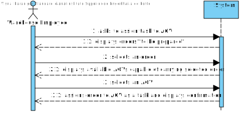

# US2003
=======================================

# 1. Requisites

**US2003** As Warehouse Employee, I want to access the list of orders that need to be prepared by an AGV and be able to ask/force any of those orders to be immediately prepared by an AGV available.

### Acceptance Criteria:

- Only orders in the "need to be prepared by an AGV" state must be displayed.
- The task can only be assigned to an AGV whose status is "free"
- The task can only be assigned to an AGV that can carry out the task (e.g. the AGV must have a weight and volume capacity high enough for the given task)

### Client Clarifications:

>**[Clarification:](https://moodle.isep.ipp.pt/mod/forum/discuss.php?d=15827)** 
> Consider that there is a products' order O1 with two distinct products P1 and P2 located in Loc1 and Loc2 respectively.
>
> When O1 is successfully paid, it is ready to be prepared by the warehouse. So, manually or automatically, this order can be assigned to an AGV as a task.
>
>Suppose, at some time, O1 is assigned to AGV_X as a task. Notice that AGV_X only accepts the task if it is free (not doing any other task) and it has the capacity to carry P1 and P2 simultaneously. Moreover, the task should have all the information required to the AGV execute the task (e.g.: products location)
>
>AGV_X starts executing the task by moving, for instance, to Loc1 in order to pick-up P1. After that, it moves to Loc2 to pick-up P2.
>
>When all products were pick-up, the AGV_X returns to its dock and drops the products. After dropping the products the task is completed.
>
>After that, the packaging process is manually done by an warehouse employee.

>**[Clarification:](https://moodle.isep.ipp.pt/mod/forum/discuss.php?d=16480)** 
>I would say that from the warehouse employee point of view, it is useful to show the order id, the order date, the customer id/name and order total.
>
>The total weight and total volume might be also useful if (s)he knows the AGV' characteristics. However, it is up to the system ensure that the selected AGV is capable of fulfilling the task.

>**[Clarification:](https://moodle.isep.ipp.pt/mod/forum/discuss.php?d=16290)** 
> The warehouse employee is able to (i) select an order that needs to be prepared; (ii): select the AGV from the ones that are available and able to perform the task; (iii) the task is sent to the selected AGV and (iv) the order change its status.

>**[Clarification:](https://moodle.isep.ipp.pt/mod/forum/discuss.php?d=16277)**
> In the scope of US 2003, the AGV is selected by the warehouse employee from the ones that are available and are able to perform the task. Tasks cannot be manually cancelled.

# 2. Analysis

## 2.1 Domain Diagram

This user story will be using the following Aggregates:

- AGV
- AGVTask
- AGVManager
- Order

[(Domain Diagram)](../../Domain%20Diagram)

## 2.2 System Sequence Diagram

# 3. Design

## 3.1. Sequence Diagram

This Sequence Diagram has the purpose to go deeper in the flow of events of this user story, showing where the responsibilities to do what lie.

## 3.2. Class Diagram

This Diagram complements the Sequence Diagram showed before, highlighting the existing relations between the different classes

## 3.3. Applied Patterns

For the realization of this user story the team used an OOP approach taking into the account of the use of a persistence context through jpa.

## 3.4. Tests
Since this user story was very communication-heavy, mostly runtime tests were performed.

1. Ensure AGV Manager acknowledged requests from the BackOffice App.
2. Ensure Digital Twin acknowledged requests from AGV Manager.
3. Test AGVTask saved Order correctly.
4. Test Order state changed when an AGV began preparing order.
5. Test Order state changed when an AGV finished preparing order.

# 4. Implementation

**AssignTaskHandler Pseudo-code:**

    AssignTaskHandler (request, in, out) {
        
        assignToAGV() {
            assertRequestCode(request, ASSIGN_TASK)
            task = in.read(request)

            out.write(ACK);

            assertRequestCode(request, AGV_ASSIGN)
            agv = in.read(request)
            
            out.write(DISCONN)

            agv.assignTask(task);

            return agv;
        }

        assignToDigitalTwin(agv) {
            connection = ConnectionEstablisher(DigitalTwinIP, DigitalTwinPort)
            connection.send(TASK_FINISH, agv)
            connection.close()
        }
    }
    
# 5. Integration/Demonstration

For demonstration purposes, the process of an AGV executing the assigned task was mocked through the Digital Twin module.

At the moment, the application simply waits a few seconds and declared the task as finished. In the following sprints, AGV movement and actions will be implemented.

# 6. Observations

This user story was already implemented taking in mind the digital twin, making sure to already call the digital twin 
server to assign the task, not only to the agv but also to the digital twin.