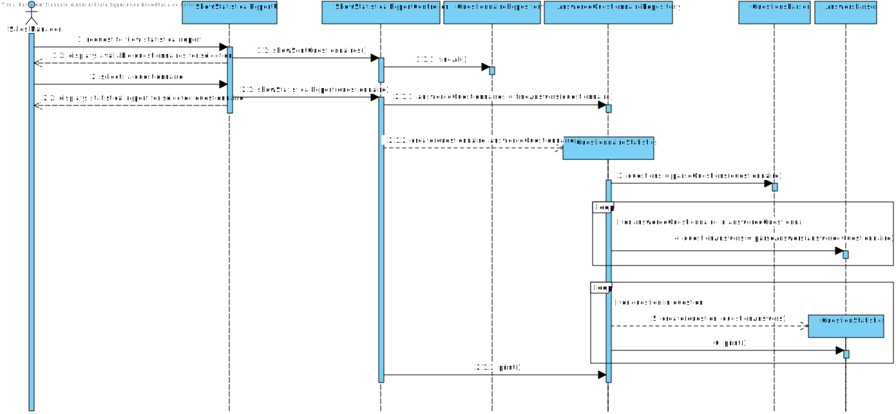
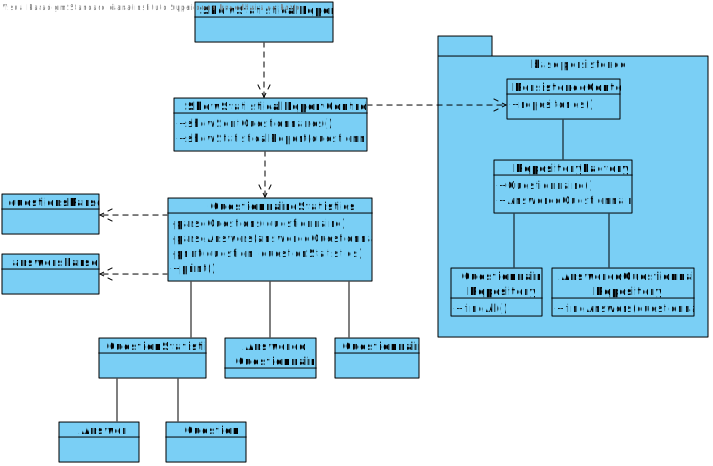

# US3002
=======================================

# 1. Requisites

**US3002** As Sales Manager, I want to get a statistical report regarding a previously set up questionnaire.

### Acceptance Criteria:

- Each report supports only one given questionnaire
- Reports are generated when requested (considers the set of answers obtained until the current moment)

### Client Clarifications:

>**[Question](https://moodle.isep.ipp.pt/mod/forum/discuss.php?d=16836):** For this US, does the statistical report need to be shown to the SalesClerk or needs to be saved in some file too (p.e. text file)?

>**Answer:** The important is to show the statistical report.
>Saving the report is not seen as relevant since, at any time, the user might request to see the report again.
>
>Notice that the information on which the report is computed is already persisted on the system.

>**[Question](https://moodle.isep.ipp.pt/mod/forum/discuss.php?d=16825):** Question: For this US, what are the types of statistical report that Sales Clerk want to see?

>**Answer:** Any report must have the basic:
>
>Universe Size (implies knowing the amount of users the survey was distributed to);
>
>Number of Responses Obtained
>
>% of responses obtained;
>
>Further, something depending on the question type:
>
>For “Single-Choice” questions:
>
>Distribution (in %) of responses for each alternative (e.g.: A = 30%, B = 27%, C = 40%, Others = 3%)
>
>For “Multiple-Choice” questions:
>
>Distribution (in %) of responses for each alternative (e.g.: A = 30%, B = 27%, C = 40%, Others = 3%)
>
>Distribution (in %) of combined responses (e.g.: A+B = 15%, A+C = 100%, B+C=100%, A+B+C=10%)
>
>For “Sorting-Options” questions:
>
>Distribution of the various hypotheses for each position (e.g.: 1st Place = A(40%) B (60%) C(0%); 2nd Place = A(50%) B(40%) C(10%); 3rd Place =A(10%) C(90%))
>
>For “Scaling-Options” questions:
>
>Distribution of each option by scale levels.
>
>I hope you got the idea.

# 2. Design

## 2.1. Sequence Diagram

This Sequence Diagram has the purpose to go deeper in the flow of events of this user story, showing where the responsibilities to do what lie.

## 2.2. Class Diagram

This Diagram complements the Sequence Diagram showed before, highlighting the existing relations between the different classes

## 2.3. Applied Patterns

For the realization of this user story the team used an OOP approach taking into the account of the use of a persistence context through JPA.

## 3.4. Tests
The accomplishment of this user story was mostly based on calculations.

1. Ensure the sum of each alternative distribution is 100% (or 1).
2. Ensure the number of answers to each question is correctly computed.
3. Assert that an error is not thrown when a question has no answers.

# 4. Implementation

**QuestionnaireStatistics Pseudo-code:**

    (...)
    //process questions for statistic computing
    questions = parseQuestions(questionnaire)

    //process answers for statistic computing
    for (answeredQuestionnaire in answeredQuestionnaires) {
        answers = parseAnswers(answeredQuestionnaire)
        sortedAnswers += sortAnswersByQuestionID(answers)
    }
    
    //generate and print statistics
    for (question in questions) {
        stats = new QuestionStatistics(question, sortedAnswers[question])
        print(stats)
    }
    (...)

**QuestionStatistics Pseudo-code:**

    distributionForEachAlternative() {
        for (answer in answers) {
            for (option in answer) {
                if (distribution.contains(option))
                    distribution[option] += 1 / answerTotal
                else
                    distribution[option][1 / answerTotal]
            }
        }
        return distribution;
    }

    distributionOfCombinedResponses() {
        //Calculate all possible answer intersections
        for (answer in answers) {
            for (otherAnswer in answers) {
                if (answer == otherAnswer) continue

                intersection = answer.intersection(otherAnswer)

                if (distribution.contains(intersection))
                    distribution[intersection] += 1 / answerTotal
                else
                    distribution[intersection][1 / answerTotal]
            }
        }
        return distribution;
    }

    (...)
