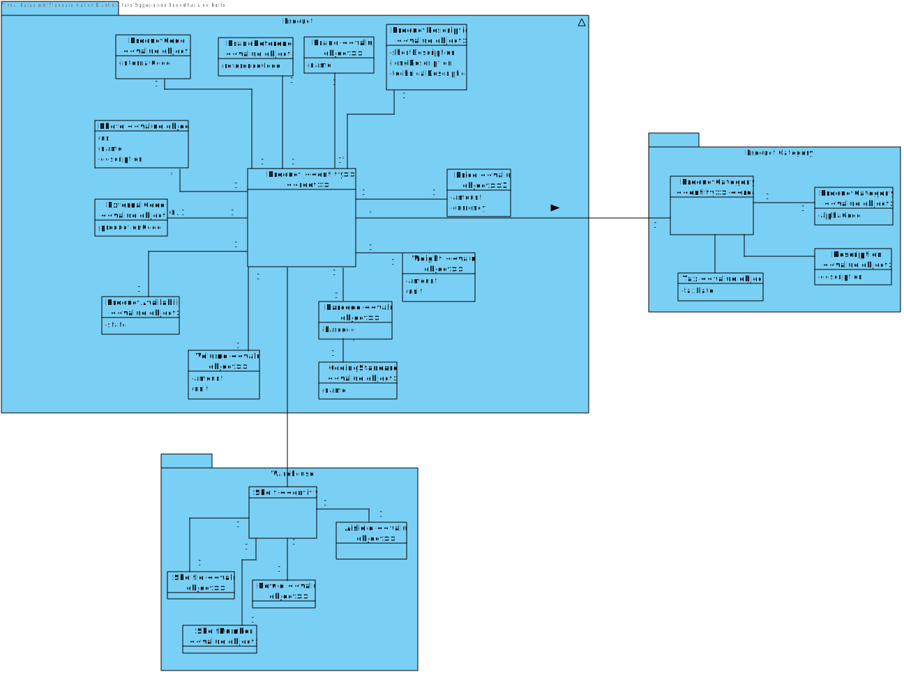
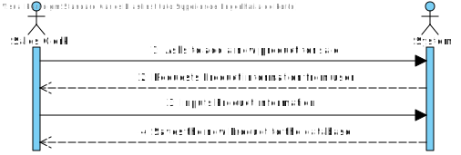
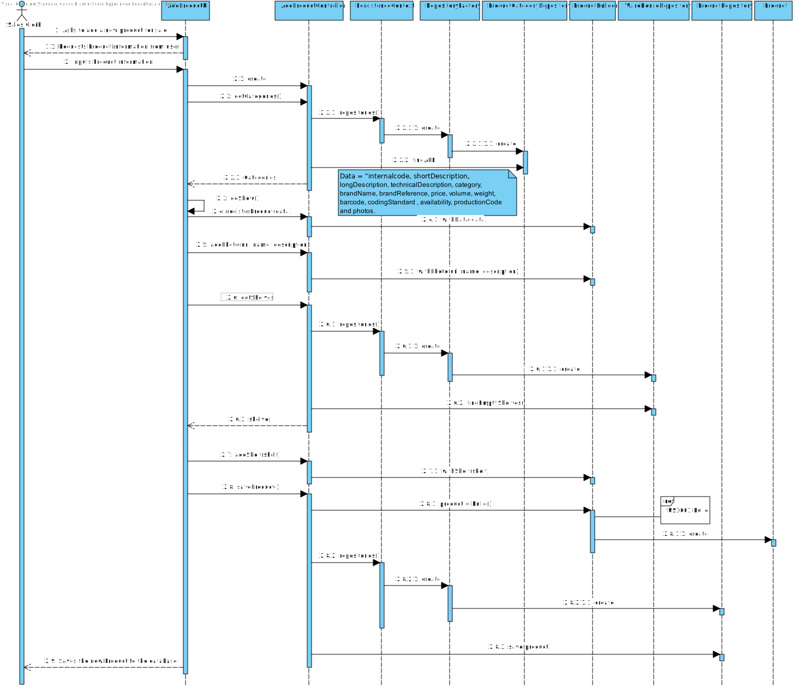
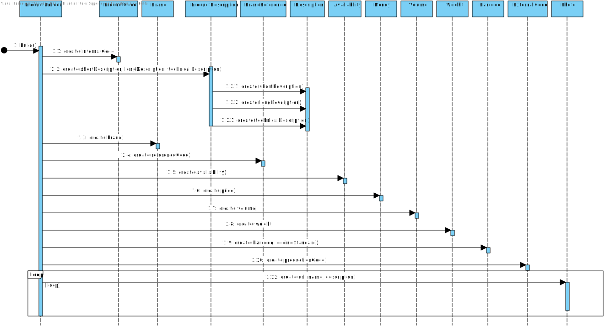
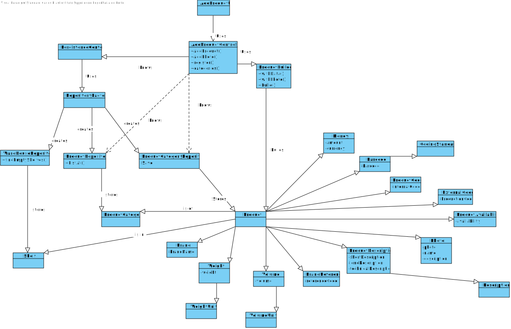

# US1001
=======================================

# 1. Requisites

**US1001** As Sales Clerk, I want to specify a new product for sale.

The team interpreted that this requirement simply needs a functionality that can register a new Product.
Since a product requires that a product category is created in order to be registers this US has a dependency in US1005.
Furthermore, when a product is registered it may be allocated to a specific shelf in a warehouse which make it dependent on US2001 that imports a warehouse's information.

# 2. Analysis

## 2.1 Domain Diagram

These are the domain entities that are going to be used by this function.

As can be seen only one aggregate will be used in this functionality

## 2.2 System Sequence Diagram

This section presents the simple flow of the sequence of events.

# 3. Design

## 3.1. Sequence Diagram

Another diagram is used to show the created classes so that the main one does not become bloated

## 3.2. Class Diagram

## 3.3. Applied Patterns

For the realization of this user story The team used an OOP approach taking into the account of the use of a persistence context through jpa.

## 3.4. Tests

**Test 1:** Verify that product value objects could not be implemented with invalid data
    
    @Test
    public void invalidDataTest(){
        assertThrows(IllegalArgumentException.class, ()->{ Barcode barcode1 = new Barcode("123456789123", null);});
        assertThrows(IllegalArgumentException.class, ()->{Barcode barcode1 = new Barcode("1234567891234", CodingStandard.UPC);});
        assertThrows(IllegalArgumentException.class, ()->{Barcode.valueOf("1234123");});
    }

    @Test
    public void invalidDataTest(){
        assertThrows(IllegalArgumentException.class, ()->{ new Brand(RandomString.generateRandomString(51));});
    }

**Test 2:** Verify that product object cannot be instanced with illegal objects 

    @Test
    public void InvalidDataTest(){
        assertThrows(IllegalArgumentException.class,
                ()->{
                new Product(internalCode, productDescriptions, category, brand, referenceCode,availability, new Money(20, Currency.getInstance("USD")), volume, weight, barcode, productionCode);
                });

        assertThrows(IllegalArgumentException.class,
                ()->{
                    Product product = new Product(internalCode, productDescriptions, category, brand, referenceCode,availability, price, volume, weight, barcode, productionCode);
                    product.addPhoto(photo);
                    product.addPhoto(photo);
                });

        assertThrows(IllegalArgumentException.class,
                ()->{
                    Product product = new Product(internalCode, productDescriptions, category, brand, referenceCode,availability, price, volume, weight, barcode, productionCode);
                    product.addShelf(shelf);
                    product.addShelf(shelf);
                });

        assertThrows(IllegalArgumentException.class,
                ()->{
                    new Product(null, productDescriptions, category, brand, referenceCode,availability, new Money(20, Currency.getInstance("USD")), volume, weight, barcode, productionCode);
                });

    }

**Test 3:** Verify a product cannot be built without enough information

     @Test
    public void invalidDataTest(){
        assertThrows(IllegalArgumentException.class,
                ()->{
        ProductBuilder builder = new ProductBuilder();
        builder.withAvailability(false).withTechnicalDescription(technicalDescription).withShortDescription(shortDescription)
                .withLongDescription(longDescription).withPhoto("src/test/java/eapli/base/productmanagement/domain/testassets/PhotoTest.jpg",
                        "Domain Model", "The domain model");
        builder.build(); });
    }
    
# 4. Implementation

**Design Conformity**

***Product***

Product has all the needed jpa annotations to ensure database compatability
    
    @Entity
    public class Product implements AggregateRoot<ProductCode> {

        /**
        * the products internal code serving as it's id
        */
        @EmbeddedId
        private ProductCode internalCode;

        /**
        * The various product descriptions (technical description is not mandatory)
        */
        @Embedded
        @AttributeOverrides({
                @AttributeOverride(name = "shortDescription.description", column = @Column(name = "shortDescription")),
                @AttributeOverride(name = "longDescription.description", column = @Column(name = "longDescription")),
                @AttributeOverride(name = "technicalDescription.description", column = @Column(name = "technicalDescription")),
        })
        private ProductDescriptions productDescriptions;

        /**
        * Product's category
        */
        @ManyToOne
        @JoinColumns({
                @JoinColumn(name = "category_alphaCode", referencedColumnName = "alphaCode")
        })
        private ProductCategory category;

        /**
       * product's Brand
       */
       @Embedded
       private Brand brand;

       /**
       * product's referenceCode
       */
       @Embedded
       private BrandReference referenceCode;

       /**
       * product's availability
       */
       @Embedded
       private ProductAvailability availability;

       /**
       * product's price in EUR
       */
       @Embedded
       private Money price;

       /**
       * product's volume
       */
       @Embedded
       private Volume volume;

       /**
       * product's weight
       */
       @Embedded
       private Weight weight;

       /**
       * product's barcode
        */
       @Embedded
       private Barcode barcode;

       /**
       * product's production code
       */
       @Embedded
       private ExternalCode productionCode;

       /**
       * product's list of photos
       */
       @ElementCollection(fetch = FetchType.LAZY)
       private final List<Photo> photos = new ArrayList<>();

       /**
        * The shelves that contain the product
        */
       @OneToMany
       private final List<Shelf> availableShelves = new ArrayList<>();

***Builder***

The builder Holds the base information of the product

    @Component
    public class ProductBuilder implements DomainFactory<Product> {

        /**
        * Mandatory fields
        */
        private ProductCode internalCode;
        private String shortDescription;
        private String longDescription;
        private ProductCategory category;
        private Brand brand;
        private BrandReference referenceCode;
        private Money price;
        private Volume volume;
        private Weight weight;
        private Barcode barcode;
        private ProductAvailability availability;

        /**
        * Non-mandatory fields
        */
        private String technicalDescription;
        private ExternalCode productionCode;
        private List<Photo> photos = new ArrayList<>();
        private List<Shelf> shelves = new ArrayList<>();  

***Controller***

The controller need access to shelve repository category repository and product repo

     /**
     * The category repository
     */
    private final ProductCategoryRepository categoryRepo = PersistenceContext.repositories().Categories();

    /**
     * The product repository
     */
    private final ProductRepository productRepo = PersistenceContext.repositories().Products();

    /**
     * The product repository
     */
    private final WarehouseRepository warehouseRepository = PersistenceContext.repositories().Warehouses();

# 5. Integration/Demonstration

This user story US uses various repositories and has many fields that need help from other user stories as such it was integrated with imported data from other tables.
It was needed to verify that only available product could be put in shelves as per product specifications.

# 6. Observations

This user story suffered various iterations as new information and specifications where being given by costumer as it was being implemented.
Another thing to point out is the photo feature as it is problematic because it only stores the information of photos relative to the computer registering it and when persisting through jpa induces in errors.
An example of photo class was used in the example repository but that implementation was transient which made us decide it was better to not adopt that strategy as it could have been hard to handle.

