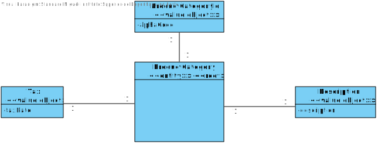
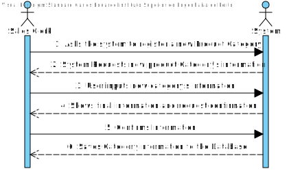
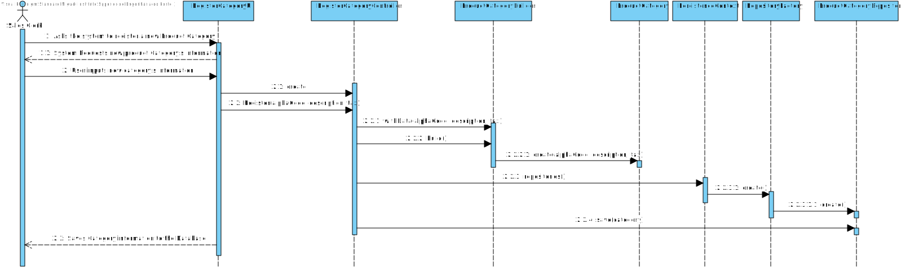
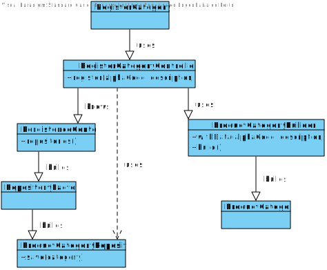

# US1005
=======================================

# 1. Requisites

**US1005** As Sales Clerk, I want to define a new category of products.

The team interpreted that this requirement simply needs a functionality that can register a new Product Category.
Since a category is an Object that not linked with any other this US does not have a dependency.

# 2. Analysis

## 2.1 Domain Diagram

These are the domain entities that are going to be used by this function.

As can be seen only one aggregate will be used in this functionality

## 2.2 System Sequence Diagram

This section presents the simple flow of the sequence of events.

# 3. Design

## 3.1. Sequence Diagram

## 3.2. Class Diagram

## 3.3. Applied Patterns

For the realization of this user story The team used an OOP approach taking into the account of the use of a persistence context through jpa.

## 3.4. Tests

**Test 1:** Verify that a category cannot be built if there isn't enough information.

    @Test
    public void invalidDataTest(){
        assertThrows(IllegalArgumentException.class,
                ()->{
                    ProductCategoryBuilder builder = new ProductCategoryBuilder();
                    ProductCategory productCategory = builder.withAlphaCode(alphaCode).build();
                });
    }
**Test 2:** Verify that a category can be built if there is enough information.
    
    @Test
    public void minimumNecessaryDataTest(){
        ProductCategoryBuilder builder = new ProductCategoryBuilder();
        ProductCategory productCategory1 = builder.withData(alphaCode, description).build();
        ProductCategory productCategory2 = builder.withTax(tax).build();
        assertNotNull(productCategory1);
        assertNotNull(productCategory2);
    }

**Test 3:** Verify that a valid category can be saved in the repository.

    @Test
    void registerCategoryTest() {
        AuthzRegistry.configure(PersistenceContext.repositories().users(),
                new BasePasswordPolicy(), new PlainTextEncoder());

        AuthenticationService authz = AuthzRegistry.authenticationService()  ;
        authz.authenticate("poweruser", "poweruserA1", BaseRoles.POWER_USER);

        RegisterCategoryController categoryController = new RegisterCategoryController();

        PersistenceContext.repositories().Categories().remove(categoryController.register("alphacode", "desc", 20));
    }

# 4. Implementation

**Class conformity** 

***ProductCategory***

    @Entity
    public class ProductCategory implements AggregateRoot<AlphaCode> {

    /**
     * The aggregate's ID which is also it's alpha code
     */
    @EmbeddedId
    private AlphaCode alphaCode;

    /**
     *  The category's description
     */
    @Embedded
    private Description description;

    /**
     *  The category's tax
     */
    @Embedded
    private Tax tax;

***ProductCategoryBuilder***

    public class ProductCategoryBuilder implements DomainFactory<ProductCategory> {

        @Override
        public ProductCategory build() {
            return new ProductCategory(AlphaCode.valueOf(alphaCode), Description.valueOf(description), Tax.valueOf(tax));
        }
    }

***RegisterCategoryController***

    public class RegisterCategoryController {
    /**
     * Authorization service that is used to make sure only authorized users can use the controller
     */
    private final AuthorizationService authz = AuthzRegistry.authorizationService();

    /**
     * The object repository
     */
    private final ProductCategoryRepository repo = PersistenceContext.repositories().Categories();

# 5. Integration/Demonstration

In order to integrate this US with the system at hand there was a need to create two classes of persistence so that it can be done through either a server or in memory.
Also, The UI was done in way that it can be easily implemented with other user should that need come.

# 6. Observations

As this was one of the first US implemented using this framework extra work was needed to make sure it stayed consistent with the rest of the produced code.                     

