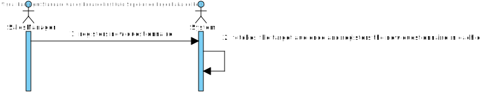
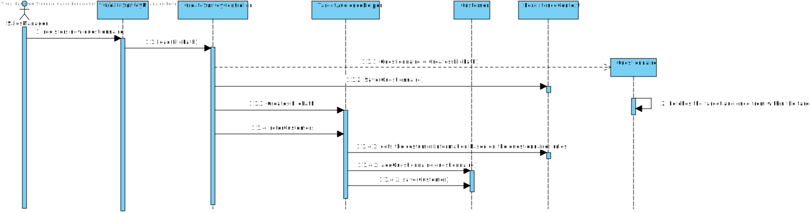
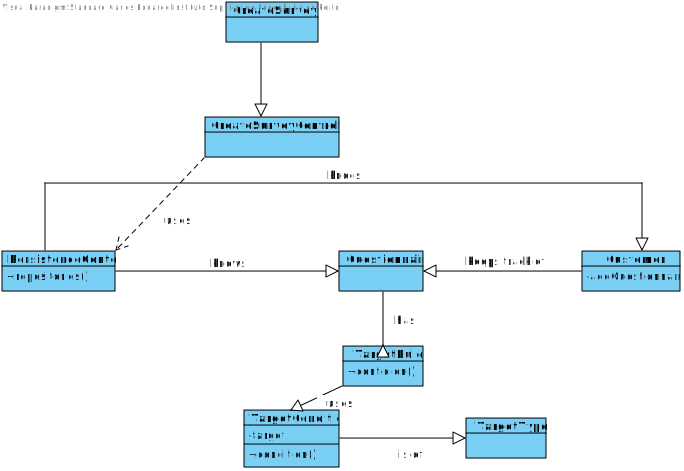

US3500
=======================================

# 1. Requisites

**As Sales Manager, I want to specify which Customers should answer a given questionnaire.**

Acceptance Criteria:
- The clients should be able to check their questionnaires.

**Q1**:
Client Clarifications:

A: It would be nice to specify more than one condition in the same rule and have more than one rule.

Example:

Rule 1 (two conditions): "Having ordered a certain product (C1) and be of a certain gender (C2)".

Rule 2 (one condition): "Living in Porto district".

The target customers would be the ones meeting Rule 1 or Rule 2.

So, you have conjunction inside a rule (C1 and C2) and disjunction between rules (R1 or R2).

At the end of Sprint D, at least one scenario (conjunction or disjunction) must be supported.

## 2.1 Domain Diagram

This user story will be using the following Aggregates:

- Questionnaire
- Customer

## 2.2 System Sequence Diagram

# 3. Design

## 3.1. Sequence Diagram

## 3.2. Class Diagram

## 3.3. Applied Patterns

For the realization of this user story The team used an OOP approach taking into the account of the use of a persistence context through JPA.

## 3.4. Tests

As the grammar takes care of checking if the questionnaire is valid, there was no need to develop tests for this US.

# 4. Implementation

# 5. Integration/Demonstration

In order to integrate this US with the system at hand there was a need to create a class for the conditions for the target audience set on the questionnaire as such a class that saves that information was created as well as a class that checks those conditions and fetches the desired clients

# 6. Observations

N/A