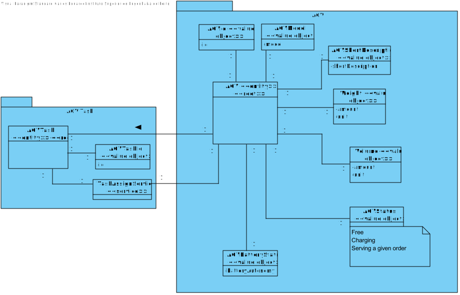
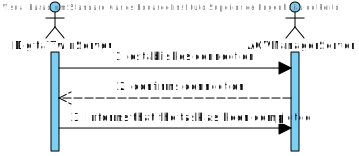
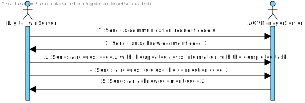
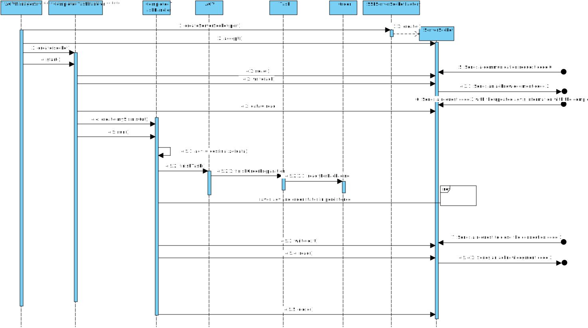
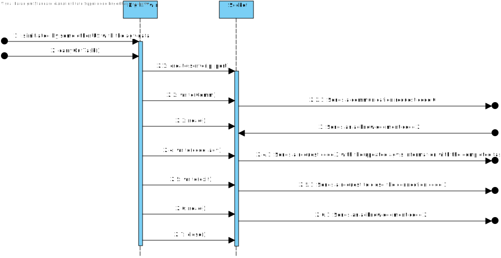
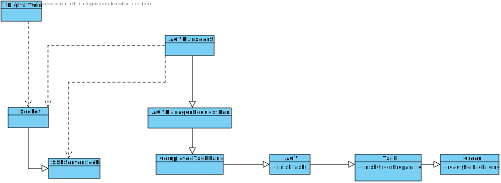

# US5001
=======================================

# 1. Requisites

**US5001** As Project Manager, I want that the team start developing the output communication module of the AGV digital twin to update its status on the "AGVManager".

Acceptance Criteria:

- It must be used the provided application protocol (SPOMS2022).

- It is suggested the adopting of concurrent mechanisms (e.g. threads) and state sharing between these mechanisms.

- In this sprint, for demonstration purposes, it is acceptable to mock processing some of the incoming requests to foster some output communication

Client Clarifications:

- [A1](https://moodle.isep.ipp.pt/mod/forum/discuss.php?d=16437#p21096): For all of those US, the communication between the two involved components must be implemented in accordance with the SPOMS2022. The requests processing can be somehow mocked. For instance, if processing a request implies saving some data to the database, the component can instead write such data to a log (mocking). Latter, on next sprint, the teams implement the interaction to the database.
However, it is not advisable mocking everything, namely the components (internal) state. Notice that by mocking you are letting extra effort to the next sprint.
Finally, all US must be demonstrable.

# 2. Analysis

## 2.1 Domain Diagram

These are the domain entities that are going to be used by this function.

As can be seen only one aggregate will be used in this functionality

## 2.2 System Sequence Diagram

This section presents the simple flow of the sequence of events.

# 3. Design

## 3.1. Sequence Diagram

## 3.2. Class Diagram

## 3.3. Applied Patterns

For the realization of this user story The team used an aproach that allows internet connectivity between different servers that house key programs that take care of requests.
The use of TCP connections as well as the SPOMS protocol to make sure the data sent is wwell handled.

## 3.4. Tests

This user story does interact directly with any user and the use case that it is taking care of is called by other userStories, 
As such there are no possible tests that can be made as all this user story does requires 2 different programs to be running in different servers.

# 4. Implementation

# 5. Integration/Demonstration

A client class was created in the AGV twin server application in order to request a use case from the agv twin server.
This functionality sends a notice that the agv has ended it's task and that the order has been prepared
A server class was started in the AGV manager server that handles the requests that come its way and then updates the data present in the database.

# 6. Observations
This user story mocks the functions of the agv twin as it will be applied in further sprints, It is only responsible for sending the information that the task was completed to the agv manager.

