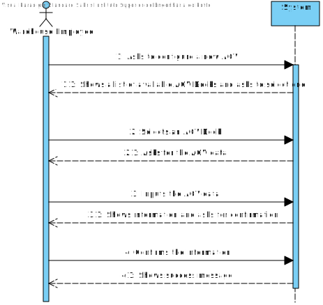

# US2002
=======================================

# 1. Requisites

**US2002** As Warehouse Employee, I want to configure the AGVs available on the warehouse.

The team interpreted that this requirement simply needs a functionality that can add (configure) a new AGV to the system. 

Since an AGV requires that an AGV Dock is created in order to be configured, this US has a dependency in [US2001](../../1191507/US2001) since loading the
warehouse plant is what is going to register the AGV Docks.

# 2. Analysis

## 2.1 Domain Diagram

Here we can see the domain entities that will take part in this user story. The main entity is the AGV, since the purpose of this
user story is to configure a new AGV and, like was mentioned before, since the AGV requires an AGV Dock to be configured, there
is also a need to use the AGV Dock aggregate, where the AGV stores a reference to the AGV Dock. 

Another thing to note is the need to have the availability for each dock, since one dock can only have one AGV and because the 
AGV Dock does not store a reference to the AGV (because no use case implies the need for that) the solution was to have an 
additional Value Object that identifies if the AGV Dock is already occupied or not.

## 2.2 System Sequence Diagram

This section presents the simple flow of the sequence of events to configure a new AGV.

# 3. Design

## 3.1. Sequence Diagram

This Sequence Diagram has the purpose to go deeper in the flow of events of this user story, showing where the responsibilities
to do what lie (e.g. the UI only has the responsibility to show data and ask for it).

## 3.2. Class Diagram

This Diagram complements the Sequence Diagram showed before, highlighting the existing relations between the different classes 

## 3.3. Applied Patterns

For the realization of this user story The team used an OOP approach taking into the account of the use of a persistence 
context through jpa.

## 3.4. Tests

**Test 1:** Test to check if AGV can't be built with missing information

    @Test
    void buildWithoutEveryData() {
        assertThrows(IllegalStateException.class, () -> defaultBuilder.withId(validId).build());

        assertThrows(IllegalStateException.class, () -> defaultBuilder.ofModel(validModel).build());

        assertThrows(IllegalStateException.class, () -> defaultBuilder.ofDescription(validShortDesc).build());

        assertThrows(IllegalStateException.class, () -> defaultBuilder.ofBatteryStatus(validBatteryStatus).build());

        assertThrows(IllegalStateException.class, () -> defaultBuilder.ofVolumeCapacity(validVolumeCap).build());

        assertThrows(IllegalStateException.class, () -> defaultBuilder.ofWeightCapacity(validWeightCap).build());

        assertThrows(IllegalStateException.class, () -> defaultBuilder.ofBaseLocation(dock).build());

        assertThrows(IllegalStateException.class, () -> defaultBuilder.ofModel(validModel)
                .ofDescription(validShortDesc)
                .ofBatteryStatus(validBatteryStatus)
                .ofVolumeCapacity(validVolumeCap)
                .ofWeightCapacity(validWeightCap)
                .ofBaseLocation(dock)
                .build());

        assertThrows(IllegalStateException.class, () -> defaultBuilder.withId(validId)
                .ofDescription(validShortDesc)
                .ofBatteryStatus(validBatteryStatus)
                .ofVolumeCapacity(validVolumeCap)
                .ofWeightCapacity(validWeightCap)
                .ofBaseLocation(dock)
                .build());

        assertThrows(IllegalStateException.class, () -> defaultBuilder.withId(validId)
                .ofModel(validModel)
                .ofBatteryStatus(validBatteryStatus)
                .ofVolumeCapacity(validVolumeCap)
                .ofWeightCapacity(validWeightCap)
                .ofBaseLocation(dock)
                .build());

        assertThrows(IllegalStateException.class, () -> defaultBuilder.withId(validId)
                .ofModel(validModel)
                .ofDescription(validShortDesc)
                .ofVolumeCapacity(validVolumeCap)
                .ofWeightCapacity(validWeightCap)
                .ofBaseLocation(dock)
                .build());

        assertThrows(IllegalStateException.class, () -> defaultBuilder.withId(validId)
                .ofModel(validModel)
                .ofDescription(validShortDesc)
                .ofBatteryStatus(validBatteryStatus)
                .ofWeightCapacity(validWeightCap)
                .ofBaseLocation(dock)
                .build());

        assertThrows(IllegalStateException.class, () -> defaultBuilder.withId(validId)
                .ofModel(validModel)
                .ofDescription(validShortDesc)
                .ofBatteryStatus(validBatteryStatus)
                .ofVolumeCapacity(validVolumeCap)
                .ofBaseLocation(dock)
                .build());

        assertThrows(IllegalStateException.class, () -> defaultBuilder.withId(validId)
                .ofModel(validModel)
                .ofDescription(validShortDesc)
                .ofBatteryStatus(validBatteryStatus)
                .ofVolumeCapacity(validVolumeCap)
                .ofWeightCapacity(validWeightCap)
                .build());
    }

**Test 2:** Test to check that an AGV can't be built with missing data (Using constructor) 
*The variables are defined with valid data*

    @Test
    void constructorInvalidData() {
        assertThrows(IllegalArgumentException.class, () -> new AGV(id, null, description, weightCap, volumeCap, dock, batteryStatus, AGVStatus.Free));
        assertThrows(IllegalArgumentException.class, () -> new AGV(id, model, null, weightCap, volumeCap, dock, batteryStatus, AGVStatus.Free));
        assertThrows(IllegalArgumentException.class, () -> new AGV(id, model, description, null, volumeCap, dock, batteryStatus, AGVStatus.Free));
        assertThrows(IllegalArgumentException.class, () -> new AGV(id, model, description, weightCap, null, dock, batteryStatus, AGVStatus.Free));
        assertThrows(IllegalArgumentException.class, () -> new AGV(id, model, description, weightCap, volumeCap, null, batteryStatus, AGVStatus.Free));
        assertThrows(IllegalArgumentException.class, () -> new AGV(id, model, description, weightCap, volumeCap, dock, null, AGVStatus.Free));
        assertThrows(IllegalArgumentException.class, () -> new AGV(id, null, null, null, null, null, null, AGVStatus.Free));
        assertThrows(IllegalArgumentException.class, () -> new AGV(null, null, null, null, null, null, null, null));
    }

**Test 3:** Test to check that an AGVModel can't be built with invalid data, making it, therefore, impossible to build an AGV with an invalid Model
*invalidModel is generated using an util class that creates a random string from given length*

    String invalidModel = RandomString.generateRandomString(51);    

    @Test
    void valueOfInvalidData() {
        assertThrows(IllegalArgumentException.class, () -> AGVModel.valueOf(" "));
        assertThrows(IllegalArgumentException.class, () -> AGVModel.valueOf(null));
        assertThrows(IllegalArgumentException.class, () -> AGVModel.valueOf(invalidModel));
    }

Similar tests are done to every Value Object that takes part of the AGV aggregate.

# 4. Implementation

**Design Conformity**

***AGV***

AGV has all the needed jpa annotations to ensure database compatability

    @Entity
    public class AGV implements AggregateRoot<AGVId> {
        @EmbeddedId
        @AttributeOverride(name="id", column=@Column(name="AGVId"))
        private AGVId id;
    
        @Embedded
        private Weight maxWeightCapacity;
    
        @Embedded
        private Volume maxVolumeCapacity;
    
        @Embedded
        private AGVModel model;
    
        @Embedded
        private AGVShortDescription shortDescription;
    
        @Enumerated(EnumType.STRING)
        private AGVStatus status;
    
        @Embedded
        private AGVBatteryStatus batteryStatus;
    
        @OneToOne(cascade = CascadeType.ALL)
        @JoinColumn(name = "current_position_square_id")
        private Square currentPosition;
    
        @OneToOne
        private AGVDock baseLocation;
    
        ...
    }

***Builder***

The builder Holds the base information of the AGV

    public class AGVBuilder implements DomainFactory<AGV> {
        /**
         * The AGV instance being builded
         */
        private AGV thisAGV;
    
        /**
         * The AGV's Identifier
         */
        private AGVId id;
    
        /**
         * The AGV's Model
         */
        private AGVModel model;
    
        /**
         * The AGV's Short Description
         */
        private AGVShortDescription desc;
    
        /**
         * The AGV's Battery Status (Battery Autonomy)
         */
        private AGVBatteryStatus batteryStatus;
    
        /**
         * The AGV's current Status (Default is 'Free')
         */
        private AGVStatus status = AGVStatus.Free;
    
        /**
         * The AGV's maximum Weight Capacity (By default the unit is G)
         */
        private Weight weightCapacity;
    
        /**
         * The AGV's maximum Volume Capacity (By default the unit is MM)
         */
        private Volume volumeCapacity;
    
        /**
         * The AGV's Dock location
         */
        private AGVDock baseLocation;

        ...
    }

***Controller***

The controller needs access to the AGV repository and the AGV Dock repository

    public class ConfigureAGVController {
        /**
         * The AGVDock repository
         */
        private final AGVDockRepository agvDockRepo = PersistenceContext.repositories().Docks();
    
        /**
         * The AGV Repository
         */
        private final AGVRepository agvRepo = PersistenceContext.repositories().AGV();
    
        ...
    }

# 5. Integration/Demonstration

In order to integrate this US with the system at hand there was a need to create two classes of persistence so that it can be done through either using JPA or in memory.
Also, The UI was done in way that it can be easily implemented with other user should that need come.

# 6. Observations

While developing this user story an issue occurred with configuring AGV with the same ID, where despite changing all the AGV data
(including the Dock) the previous dock would still remain unavailable, this was stopped by not allowing to configure AGV that already 
exist within the Database. But in future development another user story can be made where the AGV can be edited, this of course will 
come with its own business rules, hence why it was not developed here.

