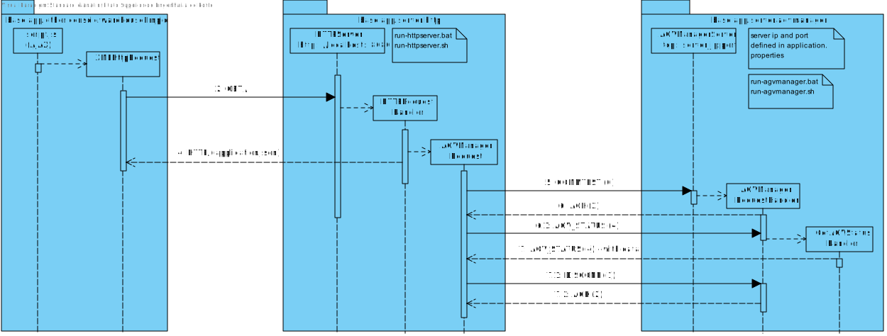
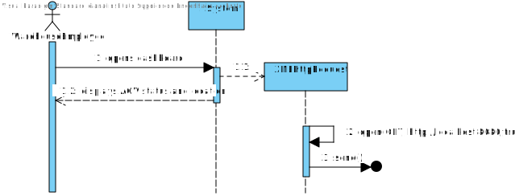
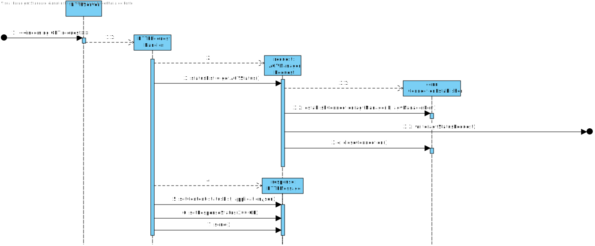
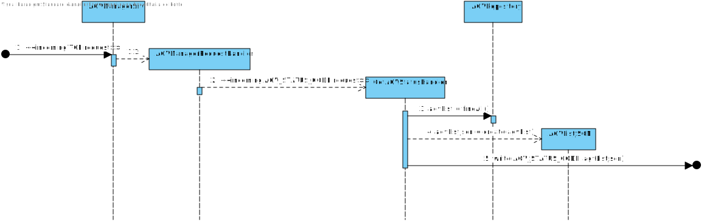
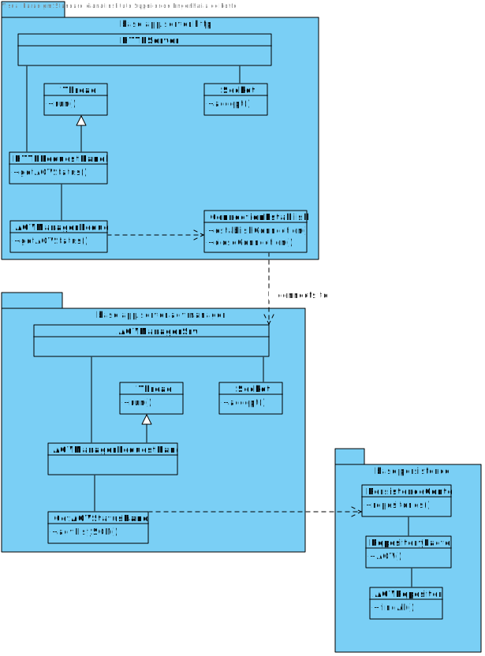

# US2005
=======================================

# 1. Requisites

**US2005** As Warehouse Employee, I want to open a web dashboard presenting the current status of the AGVs as well as their position in the warehouse layout and keeps updated automatically (e.g.: at each minute)

### Acceptance Criteria:

- Must use the provided application protocol (SPOMS2022).
- Must use an existing HTTP server in the ""BackOfficeApp"" application and only available to localhost.
- Must be kept updated without reloading (AJAX).

### Client Clarifications:

>**Q:** For this sprint do we need to simulate/calculate the draining of the battery? And how about the path that each agv is taking to prepare the order?
>If not needed, what do we display in the dashboard beside the current status if there is no real-time information about the current position of each agv?
>
>**A:** Short answer: no! There is no need to do that on Sprint C.

>**Q:** Despite in the provided sprint user stories asking for the digital twin in a web dashboard along with its status and position, in user stories of the next sprint it is said that the development of the movement of the AGV is needed which causes a minor confusion. My question is in this sprint is it required to create the movement of the AGV?
> 
> **A:** On Sprint C, the web dashboard needs to be thought and ready to show the current AGVs position, which is read from some where. Further, on sprint D, when simulating the AGV movement the AGV position will change and, therefore, we will be able to see the AGVs position changing accordingly on the web dashboard.
>
>Notice that, this is an integrative project developed following an iterative and incremental process. So, at the end, the pieces need to fit well together.

>**Q:** How would you like the dashboard to look? A simple list of the AGVS along with its position and status?
> 
> **A:** No! Preferably, the dashboard should be an approximation to what is depicted on Figure 8 of the specifications document.

### Communication Protocol
| script.js (AJAX)  |           HTTPSrv.java            | AGVManagerSrv.java |
|:-----------------:|:---------------------------------:|:------------------:|
| HTTP Client   --> | --> HTTP Server -> TCP Client --> |   --> TCP Server   |

# 2. Analysis

## 2.1 Domain Diagram

This user story will be using the following Aggregates:

- AGV

[(Domain Diagram)](../../Domain%20Diagram)

## 2.2 Communications Overview

This user story envolves HTTP/TCP communication, which will be comprised of 3 agents: 
- A webpage running AJAX (acting as a HTTP client)
- The HTTP Server (acting as an HTTP server and a TCP client)
- The AGV Manager Server (acting as a TCP server)

The following is an overview of the communication between the 3 modules, with respective protocol (request/reply codes) and running configurations.

# 3. Design

## 3.1. Sequence Diagram

## 3.2. Class Diagram

## 3.3. Applied Patterns

For the realization of this user story the team used an OOP approach taking into the account of the use of a persistence context through JPA.

## 3.4. Tests

Since this user story was very communication-heavy, mostly runtime tests were performed.

1. Ensure HTTP Server acknowledged requests from dashboard page.
2. Ensure AGV Manager acknowledged requests from HTTP Server.
3. Test AGV list is converted to a JSON string.
4. Ensure AGV Manager sent packets to HTTP Server.
5. Ensure HTTP Server acknowledged replies from AGV Manager.
6. Ensure HTTP Server constructed a valid HTTP packet.
7. Ensure HTTP server sent packets to dashboard.

# 4. Implementation

**Dashboard Pseudo-code:**

    function RefreshAGV() {
        warehouseBoard = document.getBoard()
        agvBoard = document.getAGVBoard()
        timer = document.getTimer()
    
        request = new XMLHttpRequest()
        request.open("GET", "http>//localhost:8080/", async)
        request.send()
    
        request.onload = function () {
            warehouseBoard.innerHTML = agvWarehouseFormatter(response);
            agvBoard.innerHTML = agvBoardFormatter(response);
            timer.innerHTML = 'Last update: ' + now();
        };
    }

**HTTPRequestHandler Pseudo-code:**

    function run() {
        request = new HTTPMessage(in)
        
        if(request.method() == "GET")
            response = new HTTPMessage(out)
            response.setContent(getAGVStatus(), "application/json")
            response.setResponseStatus("200 OK") 
            response.send()
    }

    function getAGVStatus() {
        connection = ConnectionEstablisher(AGVManagerIP, AGVManagerPort)
        reply = connection.send(AGV_STATUS_CODE)
        connection.close()
        return reply.read()
    }

# 5. Integration/Demonstration

The user story was developed taking into account several demo environments and integration with several setups.

Please consult the *application.properties* file of the module to be executed to consult / alter the IP address and port of each server.

