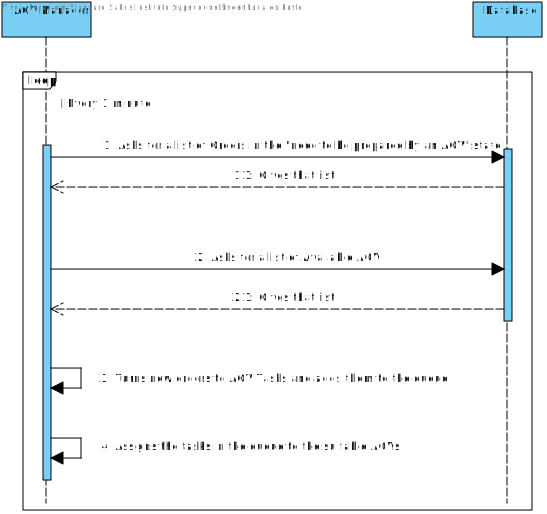
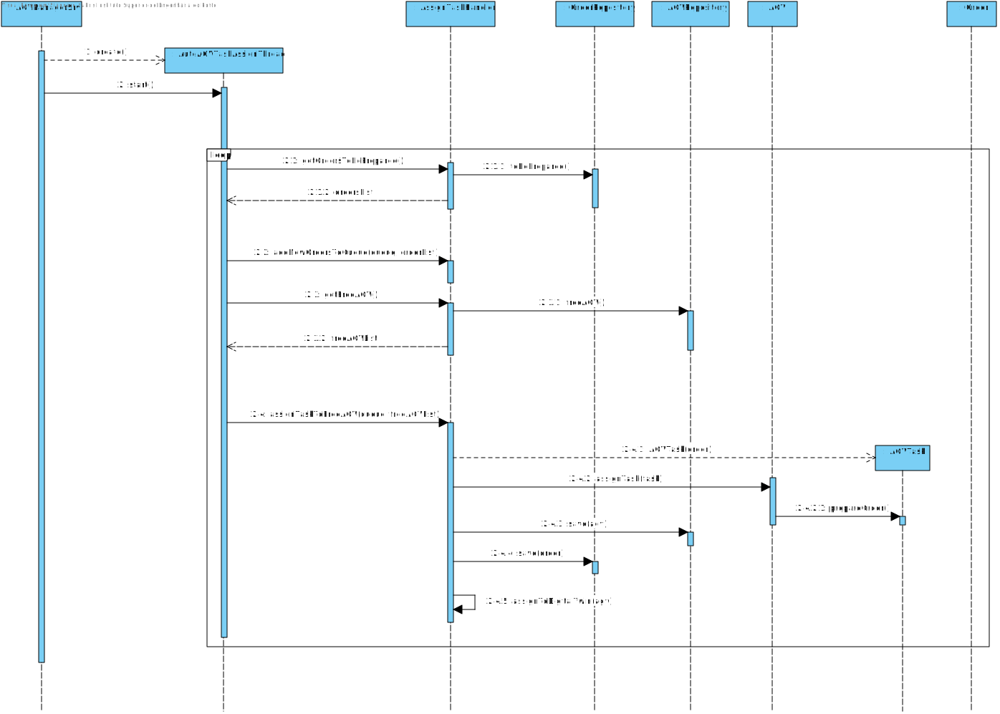
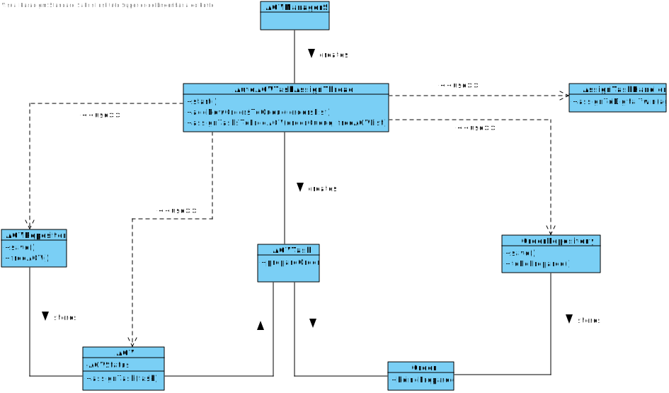

# US4002
=======================================

# 1. Requisites

**US4002** As Project Manager, I want that the "AGVManager" component is enhanced with a basic FIFO algorithm to automatically assign tasks to AGVs.

### Acceptance Criteria:

- The tasks should be assigned using a basic FIFO algorithm
- There should be a way to turn this functionality off
- Only orders in the "need to be prepared by an AGV" state must be added to the queue
- The task can only be assigned to an AGV that can carry out the task (e.g. the AGV must have a weight capacity high enough for the given task)

### Client Clarifications:

>**[Question:](https://moodle.isep.ipp.pt/mod/forum/discuss.php?d=16394#p21052)** In US4002 it is required that the AGV Manager should support automatic assignment of orders to AGVs. In US2003 the Warehouse Employee will be able to assign any order to an AGV available. If the orders are being automatically assigned to an AGV (US4002) how can the Warehouse Employee assign a specific order to an AGV?
>
>**Answer:** Usually, and by default, one intends that system automatically assigns orders to AGVs (US 4002).
>However, if such option is not available (e.g.: turned off) or by some reason an order needs to be prepared faster than it would normally be, the warehouse employee has the ability to assign tasks manually (US 2003).
>Notice that, orders that can be prepared by AGVs are being added to a queue following a FIFO algorithm (part of the US 4002). In the scope of US 2003 the FIFO algorithm does not apply... the employee might choose the order (s)he wants.

>**[Question:](https://moodle.isep.ipp.pt/mod/forum/discuss.php?d=16326#p20945)** Will the FIFO algorithm be used to control the tasks/orders that are waiting for an available AGV? If I am interpreting something wrong please clarify for me.
>
>**Answer:** The general idea is that product orders reaching a certain state whose meaning is of "need to be prepared by an AGV" are added to a queue. Then, following the FIFO algorithm orders are removed from the queue and assigned to available AGVs capable of performing the task that such order implies.

>**[Question:](https://moodle.isep.ipp.pt/mod/forum/discuss.php?d=16326#p20945)** Talking about being automatic, the System executes this functionally after some other functionality, or executes it periodically? If it is periodically, how often?
> 
>**Answer:** Teams are free to propose a solution for that problem/issue. Notice that all team decisions must be well supported in light of business need and technical constraints.

### Interpretation

Looking at the given requisites of this user story and the client clarifications, it was decided that this user story will be developed by having in mind that it will be executed periodically (e.g. every 1 minute). This decision
was made in order to avoid unnecessary extra work, since making it function, for example, every time an order changes its state to "need to be prepared by an AGV" would make it necessary to develop a watchdog, which would need
to be implemented in the Orders Server which then would make it necessary to use the SPOMS protocol to communicate with the AGV Manager to assign the task, all this just for the added bonus that every task would be assigned
right as the order reached the necessary state, which would most likely be wasted by the fact that the AGV will take time finishing its current task. So having the user story being executed periodically lowers the amount of
work needed to develop it and doesn't affect the end result in any noticeable way.

Having all that in mind, this user story will be looking for new Orders in the "need to be prepared by an AGV" state every minute, add them to a FIFO queue and when there is an available and capable AGV assign the task. Since 
this action should be constantly happening, it will be placed in a concurrent thread. Because the AGVTasks can't be assigned to an AGV  that can't perform it, it was also decided that in case the first Task in the Queue
has no currently available AGV that can perform it, the program will jump to the next task (assuming that there are indeed available AGV). A final detail is that, as was mentioned by the client, this functionality needs 
an off switch that will be placed in a config-file.

# 2. Analysis

## 2.1 Domain Diagram

This user story will be using the following Aggregates:

- AGV
- AGVTask
- AGVManager
- Order

[(Domain Diagram)](../../Domain%20Diagram)

## 2.2 System Sequence Diagram

# 3. Design

## 3.1. Sequence Diagram

This Sequence Diagram has the purpose to go deeper in the flow of events of this user story, showing where the responsibilities to do what lie.

## 3.2. Class Diagram

This Diagram complements the Sequence Diagram showed before, highlighting the existing relations between the different classes

## 3.3. Applied Patterns

For the realization of this user story the team used an OOP approach taking into the account of the use of a persistence context through jpa.

## 3.4. Tests

**Test 1:** Verify if it is possible to add new Orders to the queue.

**Test 2:** Verify if orders already in the queue don't get re-added.

**Test 3:** Verify if assigning a new Task to an AGV is possible.

**Test 4:** Verify if assigning a new Task to an AGV turns the order state to "being prepared".

# 4. Implementation

**AutoAGVTaskAssignThread Pseudo-code:**

    AutoAGVTaskAssignThread() {
        run() {
            agvRep = PersistenceContext.repositories().AGV();
            orderRep = PersistenceContext.repositories().Orders();
    
            while (true) {
                orderList = orderRep.toBePreparedSortedByDate();
        
                addNewOrdersToQueue(orderQueue, orderList);
                
                freeAGVList = agvRep.freeAGV();
        
                assignTasksToFreeAGV(orderQueue, freeAGVList);
    
                Thread.sleep(60000);
            }
        }

        addNewOrdersToQueue(orderList) {
            for (order : orderList) {
                if (!orderQueue.contains(order)) {
                    orderQueue.addLast(order);
                }
            }
        }
    
        assignTasksToFreeAGV(orderQueue, freeAGVList) {
            freeAGVCount = freeAGVList.size;
            assignedFlag = false;
    
            while (freeAGVCount > 0 && queue.size > 0) {
                if (iCount == queue.size()) 
                    break;
    
                order = orderQueue.get(iCount);
                
                for (agv : freeAGVList) {
                    if (isAGVCapable(agv, order)) {
                        task = AGVTask(order);

                        agv.assignTask(task);
                        AssignTaskHandler.assignToDigitalTwin(agv);
                        freeAGVList.remove(agv);
                        assignedFlag = true; 

                        break;
                    }
                }

                if (assignedFlag) {
                    assignedFlag = false;
                    orderQueue.remove(iCount);
                    iCount--;
                    freeAGVCount--;
                }

                iCount++;
            }
        }
    }

# 5. Integration/Demonstration

In order to integrate this US with the system at hand there was a need to turn it into a Thread that would be running in
the AGV Manager Server. This thread can be activated/deactivated using the application.properties file present in the 
server module by turning the variable AutoAGVTaskAssignerFlag to either true or false.

The current timer is set to 1 minute.

# 6. Observations

This user story was already implemented taking in mind the digital twin, making sure to already call the digital twin 
server to assign the task, not only to the agv but also to the digital twin. 

Maybe in the future the timer can be changed to take less or more time between iterations according to the average time 
the digital twin takes when performing tasks in order to reduce the amount of resources consumed.
