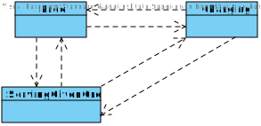
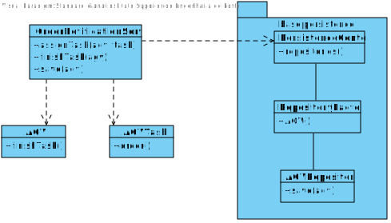

US4004
=======================================

# 1. Requisites

**As Project Manager, I want the team to implement AGV state transition validation tests.**

Acceptance Criteria:

- Valid AGV state transitions must be explicit.

- State transitions must be the responsability of a service class.

# 2. Analysis

## 2.1 Domain Diagram

These are the domain entities that are going to be used by this function.

- AGV
- Order

[Domain Diagram](../Domain Diagram/Domain Diagram.svg)

The valid order state transitions are described in the following diagram.

# 3. Design

## 3.1 Class Diagram

## 3. Tests

**Test 1:** Verify that an AGV can transition from *Free* to *ServingGivenOrder* and vice-versa 

    @Test
    void ensureTransitionFreeToServingGivenOrder() {
        //AGV with status FREE
        AGV agv = new AGV(id, model, description, weightCap, volumeCap, dock, batteryStatus, AGVStatus.Free);

        AGVTask task = new AGVTask(TestUtils.generateDummyOrder());
        agv.assignTask(task);

        assertTrue(agv.isServingOrder());
    }

    @Test
    void ensureTransitionServingGivenOrderToFree() {
        //AGV with status FREE
        AGV agv = new AGV(id, model, description, weightCap, volumeCap, dock, batteryStatus, AGVStatus.Free);

        AGVTask task = new AGVTask(TestUtils.generateDummyOrder());
        //AGV transitions to SERVING_GIVEN_ORDER
        agv.assignTask(task);
        //AGV transitions to FREE
        agv.finishTask();

        assertTrue(agv.isFree());
    }

**Test 2:** Verify that an exception is thrown when an AGV that is *ServingGivenOrder* is assigned another order 

     @Test
    void ensureTransitionServingOrderToServingOrderInvalid() {
        //AGV with status FREE
        AGV agv = new AGV(id, model, description, weightCap, volumeCap, dock, batteryStatus, AGVStatus.Free);

        AGVTask task = new AGVTask(TestUtils.generateDummyOrder());
        //AGV transitions to SERVING_GIVEN_ORDER
        agv.assignTask(task);

        assertThrows(IllegalArgumentException.class, () -> {agv.assignTask(task);});
    }
