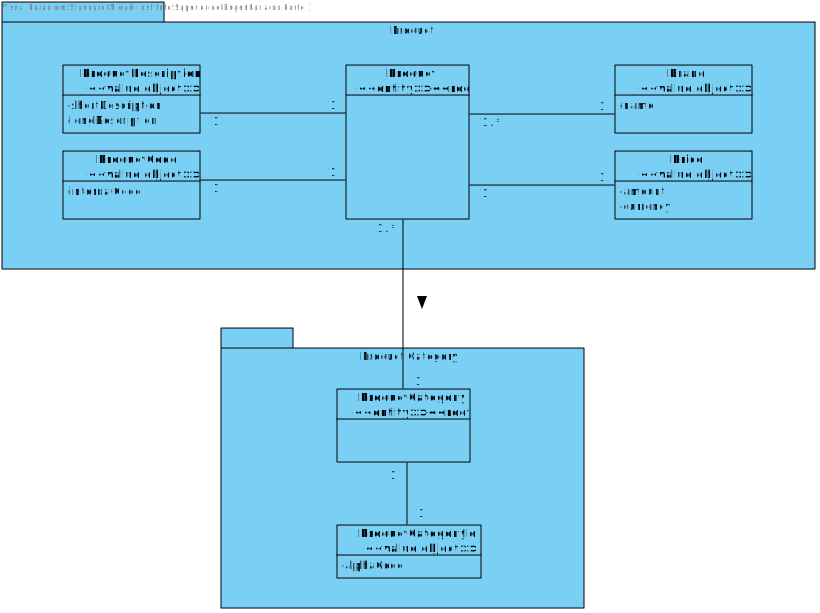
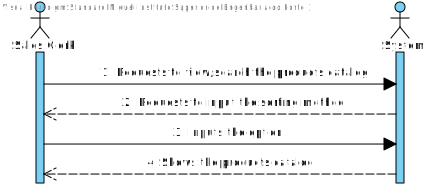
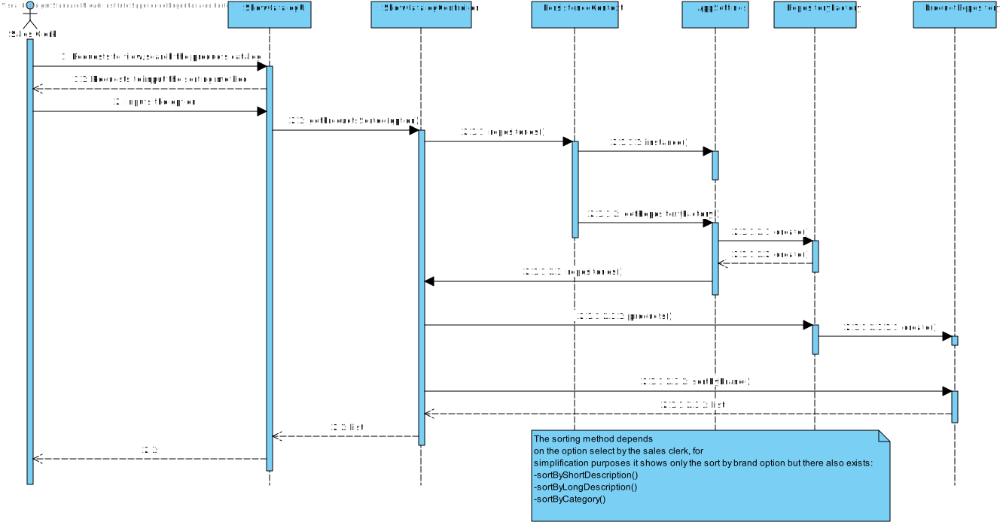
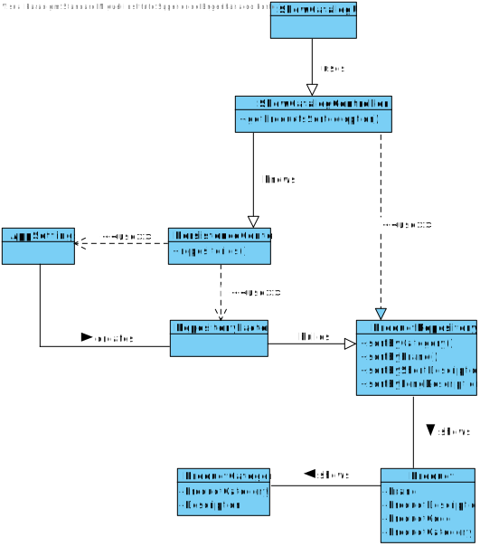

# US1002
=======================================

# 1. Requisites

**US1002** As Sales Clerk, I want to view/search the products catalog.

The team interpreted that this requirement simply needs a functionality that can show all products sorted by 4 different sorting methods: category, brand, shortDescription, longDescription
Since a category is an Object that not linked with any other this US does not have a dependency.

# 2. Analysis

## 2.1 Domain Diagram

These are the domain entities that are going to be used by this function.

As can be seen only two aggregates will be used in this functionality

## 2.2 System Sequence Diagram

This section presents the simple flow of the sequence of events.

# 3. Design

## 3.1. Sequence Diagram

## 3.2. Class Diagram

## 3.3. Applied Patterns

For the realization of this user story The team used an OOP approach taking into the account of the use of a persistence context through jpa.

## 3.4. Tests

**Test 1:** Verify that every sorting method is well ordered

       @Test
        void showCatalogTest(){
        AuthzRegistry.configure(PersistenceContext.repositories().users(),new BasePasswordPolicy(), new PlainTextEncoder());
        AuthenticationService auth = AuthzRegistry.authenticationService();
        auth.authenticate("poweruser", "poweruserA1", BaseRoles.POWER_USER);

        ShowCatalogController controller = new ShowCatalogController();

        List<Product> list = (List<Product>) controller.getProductsSorted(OptionSort.CATEGORY);
        Product firstElement = list.get(0);
        Product lastElement = list.get(list.size()-1);
        Assertions.assertNotNull(list);
        Assertions.assertTrue(firstElement.getCategory().compareTo(lastElement.getCategory().getAlphaCode()) < 0);

        list = (List<Product>) controller.getProductsSorted(OptionSort.BRAND);
        firstElement = list.get(0);
        lastElement = list.get(list.size()-1);
        Assertions.assertNotNull(list);
        Assertions.assertTrue(firstElement.getBrand().compareTo(lastElement.getBrand())< 0);

        list = (List<Product>) controller.getProductsSorted(OptionSort.SHORT_DESCRIPTION);
        firstElement = list.get(0);
        lastElement = list.get(list.size()-1);
        Assertions.assertNotNull(list);
        Assertions.assertTrue(firstElement.getProductDescriptions().shortestDescription().compareTo(lastElement.getProductDescriptions().shortestDescription())< 0);

        list = (List<Product>) controller.getProductsSorted(OptionSort.LONG_DESCRIPTION);
        firstElement = list.get(0);
        lastElement = list.get(list.size()-1);
        Assertions.assertNotNull(list);
        Assertions.assertTrue(firstElement.getProductDescriptions().longestDescription().compareTo(lastElement.getProductDescriptions().longestDescription())< 0);
    }

# 4. Implementation

**Class conformity** 

***ShowCatalogController***

    As evidenced in the Sequence Diagram and Class Diagram, the controller of this User Story possess a main method and another four secondary methods for every single sorting method.
    As it can be also seen in the diagram, the operator will introduce one sorting option that will the controller decide which private method it will use.
    Following next a representation of the main method and one of the four secondary methods

    public Iterable<Product> getProductsSorted(OptionSort option){

        Iterable<Product> result = new ArrayList<>();
        
        switch(option){
            case CATEGORY:
                result = sortByCategory();
                break;
            case BRAND:
                result = sortByBrand();
                break;
            case SHORT_DESCRIPTION:
                result = sortByShortDescription();
                break;
            case LONG_DESCRIPTION:
                result = sortByLongDescription();
                break;
        }
        return result;
    }

    private Iterable<Product> sortByLongDescription(){
        return productRepo.sortByLongDescription();
    }

    To conclude the conformity with design, there is also the need to remind that the controller also possesses the product repository, also present in both diagrams.

    /**
     * The product repository
     */
    private final ProductRepository productRepo = PersistenceContext.repositories().Products();

# 5. Integration/Demonstration

In order to integrate this US with the system at hand there was a need to create two classes of persistence so that it can be done through either a server or in memory.
Also, The UI was done in way that it can be easily implemented with other user should that need come.

# 6. Observations

N/A                  

