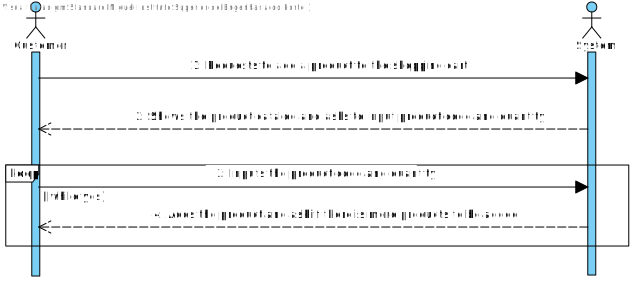
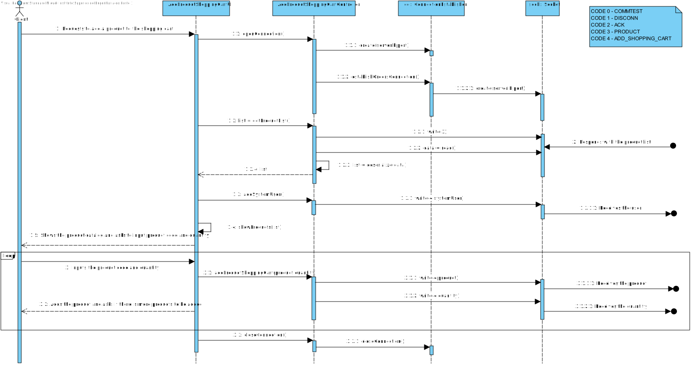
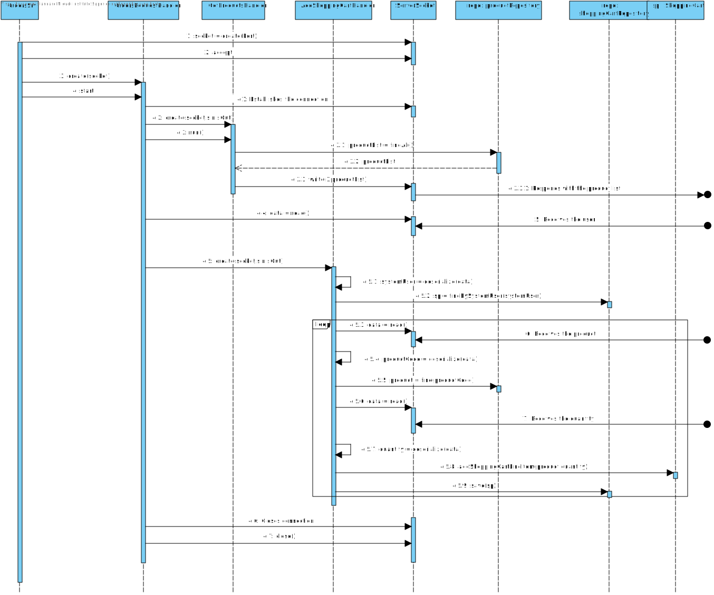

US1501
=======================================

# 1. Requisites

**As Customer, I want to view/search the product catalog and be able to add a product to the shopping cart.**

Acceptance Criteria:

- It is mandatory using the "OrdersServer" component

# 2. Analysis

## 2.1 Domain Diagram

This user story will be using the following Aggregates:

- Product
- Product Category
- Shopping Cart

[(Domain Diagram)](../../Domain%20Diagram)

## 2.2 System Sequence Diagram

This section presents the simple flow of the sequence of events.

# 3. Design

## 3.1. Sequence Diagram

## 3.2. Class Diagram

## 3.3. Applied Patterns

For the realization of this user story the team used an OOP approach taking into the account of the use of a persistence context through JPA.
Also, an approach was used that allows internet connectivity between different servers that house key programs that take care of requests.
The use of TCP connections as well as the SPOMS protocol to make sure the data sent is well handled.

## 3.4. Tests

There are no possible tests that can be made as all this user story does requires 2 different programs to be running in different servers.

# 4. Implementation

**Class conformity**

***AddProductsShoppingCartController***

    public class AddProductShoppingCartController {

    (...)

     /**
     * Adds a new product to the shopping cart
     * @param product the selected product
     * @param quantity the selected quantity
     */
    public void addProductShoppingCart(String product, int quantity){
        try {
            sOut.write(PacketUtils.toData(4,product));
            sIn.readUnsignedByte();
            System.out.println(product);

            if(sIn.readUnsignedByte() != 2) throw new IOException("Did not receive the expected answer from the orders server");
            sIn.skipBytes(2);

            sOut.write(PacketUtils.toData(4,Quantity.valueOf(quantity)));
            System.out.println(quantity);
            sIn.readUnsignedByte();

            if(sIn.readUnsignedByte() != 2) throw new IOException("Did not receive the expected answer from the orders server");
            sIn.skipBytes(2);

        }catch (IOException e){
            System.out.println("Could not open data stream.");
            System.exit(1);
        }
    }
    
    (...)

    }

***ConnectionEstablisher***

    /**
     * Establishes the connection to the orders  server
     */
    public void establishOrdersConnection() {

        try {
            serverIP = InetAddress.getByName(server);
        } catch(UnknownHostException ex) {
            System.out.println("Invalid server: " + server);
            System.exit(1);
        }

        try {
            sock = new Socket(serverIP, port);
        } catch(IOException ex) {
            System.out.println("Failed to connect.");
            System.exit(1);
        }

        try {
            sIn = new DataInputStream(sock.getInputStream());
            sOut = new DataOutputStream(sock.getOutputStream());

            sOut.write(PacketUtils.COMM_DATA);

            byte[] response = new byte[4];
            sIn.read(response);

            if (response[CODE_OFFSET] != 2)
                throw new IllegalArgumentException("Response packet is faulty");

        } catch (IOException e) {
            System.out.println("Could not open data stream.");
            System.exit(1);
        }
    }

    /**
     * Closes the connection to the orders server
     */
    public void closeConnection(){
        try{
            sOut.write(PacketUtils.toData(1,null));
            sIn.readUnsignedByte();
            if(sIn.readUnsignedByte() == 2) sock.close();
        }catch (IOException e){
            System.out.println("Could not open data stream.");
            System.exit(1);
        }
    }

# 5. Integration/Demonstration

A client class was created in the controller  in order to request a use case from the order's server.
A server class was started in the orders' server that handles the requests that come its way and then updates the data present in the database

# 6. Observations

N/A

