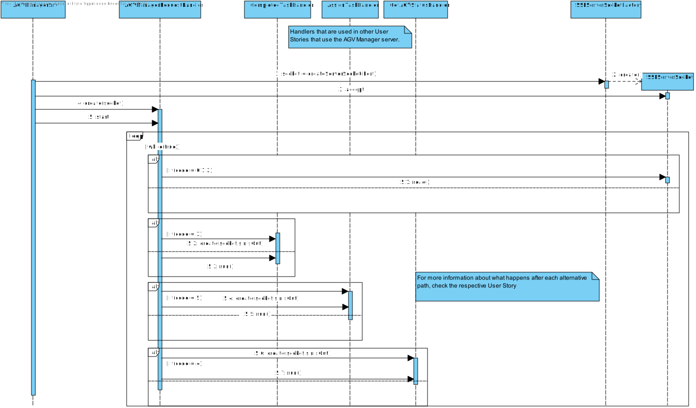
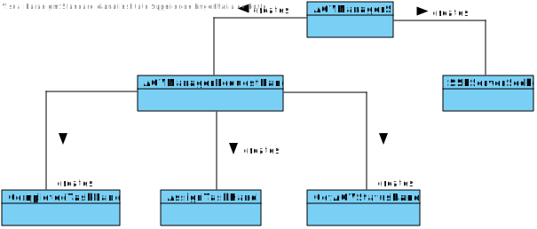

US4001
=======================================

# 1. Requisites

**As Project Manager, I want that the "AGVManager" component supports properly, at request, the needs of the "BackOfficeApp" application as well as the needs the AGV digital twin.**

Acceptance Criteria:

- It must be used the provided application protocol (SPOMS2022).

- It is suggested the adopting of concurrent mechanisms (e.g. threads) and state sharing between these mechanisms.

Client Clarifications:

- **Q1:** What would you consider its complete state, that is, what would be the criterion to define whether or not this US is functional?

  **A:** The communication between the two involved components must be implemented in accordance with the SPOMS2022. Must be demonstrable.

# 2. Analysis

## 2.1 Domain Diagram

This user story will be using the following Aggregates:

- AGV Manager
- AGV

[(Domain Diagram)](../../Domain%20Diagram)

## 2.2 System Sequence Diagram

There is no possible representation of the SSD because there is no sequence of events to be portrayed. 

# 3. Design

## 3.1. Sequence Diagram

## 3.2. Class Diagram

## 3.3. Applied Patterns

For the realization of this user story the team used an approach was used that allows internet connectivity between different servers that house key programs that take care of requests.
The use of TCP connections as well as the SPOMS protocol to make sure the data sent is well handled.

## 3.4. Tests

There are no possible tests that can be made as all this user story does requires 2 different programs to be running in different servers.

# 4. Implementation

**Class conformity**

***AGVManagerSrv***

    public class AGVManagerSrv {

    /**
     * The server's socket
     */
    private static ServerSocket sock;

    public static void main(String[] args) throws Exception {

        try {
            sock = new ServerSocket(9304);
            System.out.println(sock.getInetAddress());
        } catch(IOException ex) {
            System.out.println("Local port number not available.");
            System.exit(1);
        }

      (...)
        while(true) {
            Socket s = sock.accept(); // wait for a new client connection request
            System.out.println("Connected to ip " + s.getInetAddress().getHostAddress());
            Thread requestHandler = new Thread(new AGVManagerRequestHandler(s));
            requestHandler.start();
        }
    }

***AGVManagerRequestHandler***

     (...)
     while (flag) {
                int version = sIn.readUnsignedByte();
                int code = sIn.readUnsignedByte();
                System.out.println("Received request with code " + code);
                switch (code) {
                    case COMMTEST:
                        //Skips the rest of the bytes and writes back an acknowledgment that the packet was received
                        sIn.skipBytes(2);
                        sOut.write(PacketUtils.ACK_DATA);
                        System.out.println("Reply sent with code " + PacketUtils.ACK_DATA[CODE_OFFSET]);
                        break;
                    case DISCONN:
                        //Skips the rest of the bytes and writes back an acknowledgment that the packet was received and
                        // finally stops the loop by closing the socket
                        sIn.skipBytes(2);
                        sOut.write(PacketUtils.ACK_DATA);
                        System.out.println("Disconnecting user " + myS.getInetAddress().getHostAddress());
                        myS.close();
                        flag = false;
                        break;
                    case ACK:
                        //Ascertains if a connection was made
                        System.out.println("\nConnection test acknowledged");
                        break;
                    case TASK_FINISH:
                        //if the code is of a finished task the updates the task to completed
                        CompletedTaskHandler taskHandler = new CompletedTaskHandler(myS, sIn, sOut);
                        taskHandler.run();
                        break;
                    case TASK_ASSIGN:
                        AssignTaskHandler assignHandler = new AssignTaskHandler(myS, sIn, sOut);
                        assignHandler.run();
                        break;
                    case AGV_STATUS:
                        //if the code is a request of AGV status returns the status
                        sIn.skipBytes(2);
                        GetAGVStatusHandler agvHandler = new GetAGVStatusHandler(myS, sIn, sOut);
                        agvHandler.run();
                        break;
                }
            }
     (...)
}

# 5. Integration/Demonstration

A server class is started in the AGVManager's server that handles the requests that come its way and then updates the data present in the database

# 6. Observations

Since this user story only makes sense when used by the other US that need her, we represent only the base of how it works.
To more information check the user stories that user this one.

