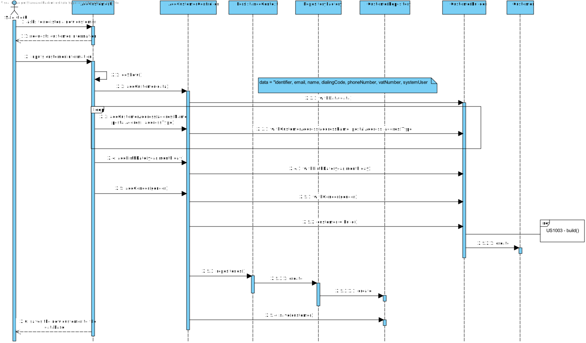

# US1003
=======================================

# 1. Requisites

**US1003** As Sales Clerk, I want to register a new customer.

The team interpreted that this requirement needs a functionality that can register a new Customer object. 
This US has no dependency with another US, being able to implement it without road blocks.
When registering a Customer, there will be also a creating of a new SystemUser related to that same customer,
the user credentials are created by the respective Sales Clerk, as per the User Case.

# 2. Analysis

## 2.1 System Sequence Diagram

This section presents the simple flow of the sequence of events.

## 2.2 Domain Diagram

These are the domain entities that are going to be used by this function.

## 3.1. Sequence Diagram

Another diagram is used to show the created classes so that the main one does not become too bloated.

## 3.2. Class Diagram

## 3.3. Applied Patterns

For the realization of this US the team used an OOP approach taking into consideration the persistence context through JPA.

## 3.4. Tests

**Test 1:** Verifies that any customer value object could not be implemented with invalid data.

    @Test
    public void emptyConstructorTest(){
        Exception exception = assertThrows(IllegalArgumentException.class, () -> new BirthDate(0,0,0));
        String expectedMessage = ("Invalid birth date");
        String actualMessage = exception.getMessage();
        assertTrue(expectedMessage.contains(actualMessage));
    }

    @Test
    public void invalidConstructorTest(){
        Exception exception = assertThrows(IllegalArgumentException.class, () -> new BirthDate(-1,3,-4));
        String expectedMessage = ("Invalid birth date");
        String actualMessage = exception.getMessage();
        assertTrue(expectedMessage.contains(actualMessage));
    }

    @Test
    public void invalidConstructorTest(){
        Exception exception = assertThrows(IllegalArgumentException.class, () -> new Email("abc"));
        String expectedMessage = ("Invalid email");
        String actualMessage = exception.getMessage();
        assertTrue(expectedMessage.contains(actualMessage));
    }

**Test 2:** Verifies that a customer's object cannot be instanced without the mandatory objects.

    @Test
    public void invalidConstructorTest(){
        assertThrows(IllegalArgumentException.class, ()-> {
            CustomerBuilder builder = new CustomerBuilder();
            builder.withBirthDate(30,11,2020).withGender("Male").withCustomerAddress(addressName1,postalAddressName1,ship);
            builder.build();
        });
    }

**Test 3:** Verifies that it's possible to add optional objects to an already existing customer object.

    @Test
    public void constructorTest(){
        CustomerBuilder builder = new CustomerBuilder();
        builder.withData(identifier,email,name,dialingCode,phoneNumber,vatNumber,systemUser);
        assertNotNull(builder.build());
        builder.withBirthDate(30,11,2020).withGender("Male");
        assertNotNull(builder.build());
        builder.withCustomerAddress(addressName1,postalAddressName1,ship).withCustomerAddress(addressName2,postalAddressName2,bill);
        assertNotNull(builder.build());
    }

**Test 4:** Verifies that any customer value object can't be empty.

    @Test
    public void emptyConstructorTest(){
        Exception exception = assertThrows(IllegalArgumentException.class, () -> new CustomerAddress(null,postalAddress1, ship));
        String expectedMessage = ("At least one of the required method parameters is null");
        String actualMessage = exception.getMessage();
        assertTrue(expectedMessage.contains(actualMessage));
    }

# 4. Implementation

**Design Conformity**

***Customer***

Customer has all the needed JPA annotations to ensure database compatability.

    @Entity
    public class Customer implements AggregateRoot<CustomerIdentifier> {
    
        @EmbeddedId
        private CustomerIdentifier id;
    
        @Embedded
        private Email email;
    
        @Embedded
        private Name name;
    
        @Embedded
        private PhoneNumber phoneNumber;
    
        @Embedded
        private VATNumber vatNumber;
    
        @Embedded
        private Gender gender;
    
        @Embedded
        private BirthDate birthDate;
    
        @ElementCollection
        private List<CustomerAddress> customerAddresses;
    
        @OneToOne(fetch = FetchType.LAZY, mappedBy = "customer")
        private ShoppingCart shoppingCart;
    
        @OneToOne()
        private SystemUser systemUser;
    }

***Builder***

The builder holds the base information of the customer.

    @Component
    public class CustomerBuilder implements DomainFactory<Customer> {

        /**
         * Mandatory Fields
         */
        private List<CustomerAddress> customerAddressList = new ArrayList<>();
        private CustomerIdentifier customerIdentifier;
        private Email email;
        private Name name;
        private PhoneNumber phoneNumber;
        private VATNumber vatNumber;
        private SystemUser systemUser;

        /**
         * Non-Mandatory Fields
         */
        private BirthDate birthDate;
        private Gender gender;
    }

***Controller***

The controller need access to customer repository. Also needs UserManagementService class to register a new system user.

    public class AddCustomerController {

        /**
         * Authorization service that is used to make sure only authorized users can use the controller
         */
        private final AuthorizationService authz = AuthzRegistry.authorizationService();
    
        /**
         * The category repository
         */
        private final CustomerRepository repo = PersistenceContext.repositories().Customer();
    
        /**
         * Service needed in order to register new system user
         */
        private final UserManagementService userSvc = AuthzRegistry.userService();
    
        /**
         * The builder used by this controller
         */
        private CustomerBuilder builder = new CustomerBuilder();
    }

# 5. Integration/Demonstration

This US only takes use of the Customer repository and the UserManagementService. 
As it wasn't dependent from other US, implementation didn't suffer any delays/constraints.

Every new customer must have a system user attached to it. Since to register a new system user
we need to specify a new username and password, there was a need to implement those options in the UI
in such a way that felt natural to the Sales Clerk.

# 6. Observations

The implementation of this US was made in a way that, in case we need to add more Value Objects to the customer, we can do so without running into many troubles.
