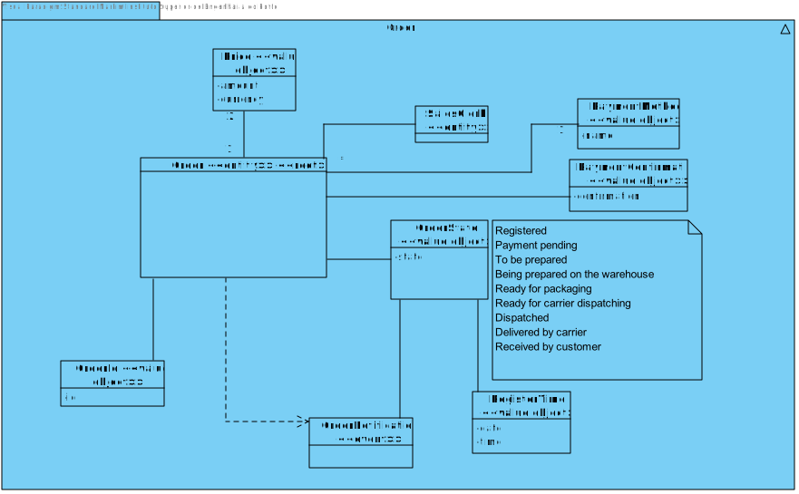
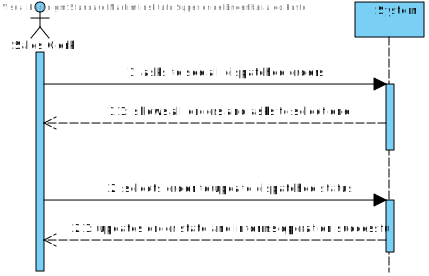
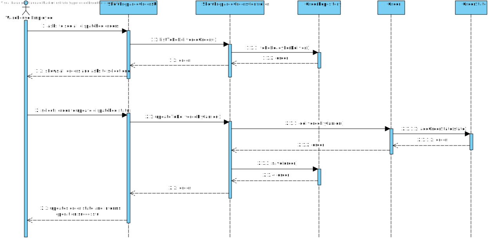
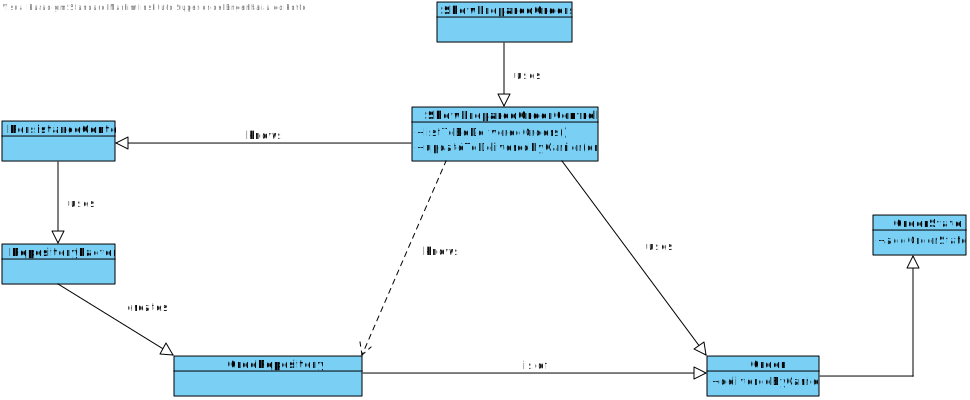

US1006
=======================================

# 1. Requisites

**As Sales Clerk, I want to access a list of orders that had been dispatched for customer delivery and be able to update some of those orders to as being delivered.**

# 2. Analysis

## 2.1 Domain Diagram

This user story will be using the following Aggregate(s):

- Order

## 2.2 System Sequence Diagram

This section presents the simple flow of the sequence of events.

# 3. Design

## 3.1. Sequence Diagram

## 3.2. Class Diagram

## 3.3. Applied Patterns

For the realization of this user story the team used an OOP approach taking into the account of the use of a persistence context through JPA.

# 4. Implementation

**Class conformity**

***ShowOrdersController***

    public class ShowOrdersController {
        /**
         * Returns an Iterable with all the Saved orders
         * @return an Iterable with all the Saved orders
         */
        public Iterable<Order> listToBeDeliveredOrders() {
            return ordersRepo.toBeReadyForDeliver();
        }
        
        /**
         * Updates the state of an order to "DELIVERED BY CARRIER"
         * @param order the order that will be updated
         */
        public void updateToDeliveredByCarrier(Order order){
            order.deliveredByCarrier();
            ordersRepo.save(order);
        }
    }

***Order***

     public class Order implements AggregateRoot<Long> { 
        /**
         * sets the order state as "DELIVERED_BY_CARRIER"
         */
        public void deliveredByCarrier() {
            if (!getLastOrderState().checkStateSequence(OrderState.State.DELIVERED_BY_CARRIER))
                throw new IllegalStateException("Order has not been delivered by carrier.");
    
            OrderState state = new OrderState(OrderState.State.DELIVERED_BY_CARRIER, RegisterTime.now());
            addOrderState(state);
        }
    }

# 5. Integration/Demonstration

In order to integrate this US there was a need to filter all the orders with a state of being dispatched.

To do so, we require the use of a query to filter through all the orders and find those in the wished state. With that we will have
a complete list of all the needed orders.

Following, once the Sales Clerk selects the option to see all the filtered orders he will be able to select any of them,
updating the select one to a state of delivered by carrier. In order to avoid confusion, the orders have all their information presented.

# 6. Observations

N/A
