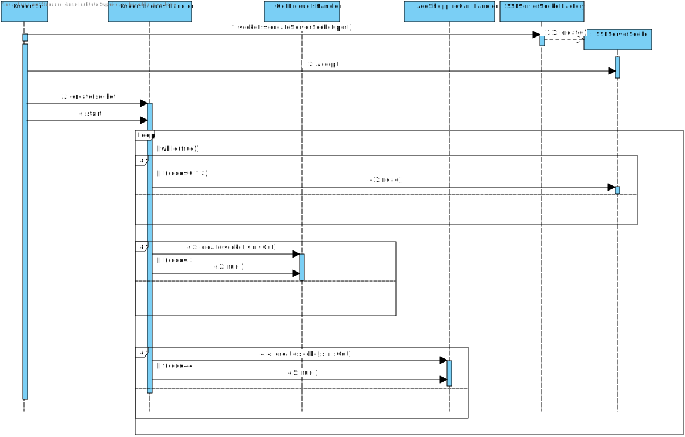
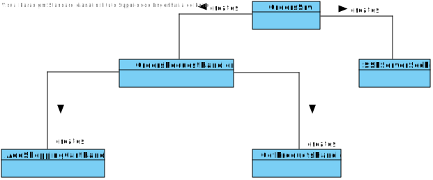

US1901
=======================================

# 1. Requisites

**As Project Manager, I want that the "OrdersServer" component supports properly, at request, the needs of the "CustomerApp" application.**

Acceptance Criteria:

- It must be used the provided application protocol (SPOMS2022)
- It is suggested the adoptiong of concurrent mechanisms (e.g. threads) and state sharing between these mechanisms.

## 2.1 Domain Diagram

This user story will be using the following Aggregates:

- Order
- Product
- Shopping Cart

## 2.2 System Sequence Diagram

There is no possible representation of the SSD because there is no sequence of events to be portrayed.

# 3. Design

## 3.1. Sequence Diagram

## 3.2. Class Diagram

## 3.3. Applied Patterns

For the realization of this user story the team used an approach that allows internet connectivity between different servers that house key programs that take care of requests.
The use of TCP connections as well as the SPOMS protocol to make sure the data sent is well handled.

## 3.4. Tests

There are no possible tests that can be made as all this user story does requires 2 different programs to be running in different servers.

# 4. Implementation

**Class conformity**

***OrdersSrv***

    public class OrdersSrv {

        private static ServerSocket sock;
    
        public static void main(String[] args) throws Exception {
            Socket s;
    
            try{ sock = new ServerSocket(9505);
            } catch (IOException ex){
                System.out.println("Local port number not available.");
                System.exit(1);
            }
    
            System.out.println("Server has started");
            while(true){
                s = sock.accept();
                System.out.println("Connected to ip " + s.getInetAddress().getHostAddress());
                new Thread(new OrdersRequestHandler(s)).start();
            }
        }
    
    }

***OrdersRequestHandler***

    while(flag) {
        sIn.readUnsignedByte();
        int code = sIn.readUnsignedByte();
        switch (code) {
            case COMMTEST:
                sIn.skipBytes(2);
                sOut.write(PacketUtils.ACK_DATA);
                break;
            case DISCONN:
                sIn.skipBytes(2);
                sOut.write(PacketUtils.ACK_DATA);
                System.out.println("Disconnecting user " + myS.getInetAddress().getHostAddress());
                myS.close();
                flag = false;
                break;
            case ACK:
                System.out.println("\nConnection test acknowledged");
                break;
            case PRODUCT:
                sIn.skipBytes(2);
                GetProductsHandler productsHandler = new GetProductsHandler(myS,sIn,sOut);
                productsHandler.run();
                break;
            case ADD_SHOPPING_CART:
                AddShoppingCartHandler shoppingCartHandler = new AddShoppingCartHandler(myS,sIn,sOut);
                shoppingCartHandler.run();
                myS.close();
                flag = false;
                break;
        }
    }

# 5. Integration/Demonstration

A server class is started in the Orders' server that handles the requests that comes its way and then updates the data present in the database.

# 6. Observations

Since this user story only makes sense when used by the other US that need her, we represent only the base of how it works.
To more information check the user stories that use this one.