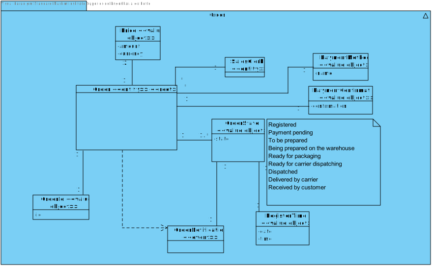
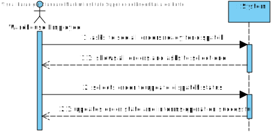
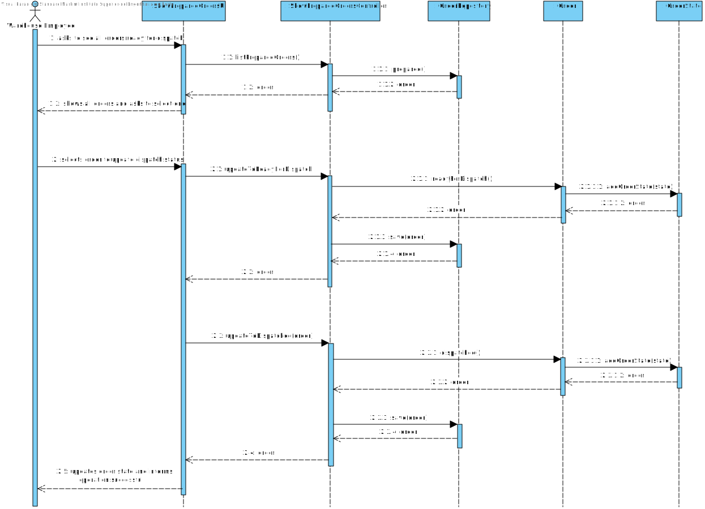
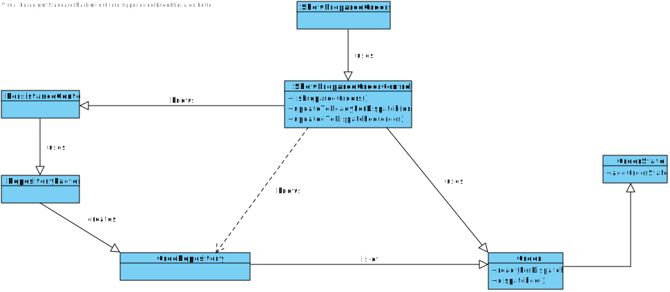

US2004
=======================================

# 1. Requisites

**As Warehouse Employee, I want to access the list of orders that have already been prepared by the AGVs and be able to update any of those orders as having been dispatched for customer delivery.**

# 2. Analysis

## 2.1 Domain Diagram

This user story will be using the following Aggregate(s):

- Order

## 2.2 System Sequence Diagram

This section presents the simple flow of the sequence of events.

# 3. Design

## 3.1. Sequence Diagram

## 3.2. Class Diagram

## 3.3. Applied Patterns

For the realization of this user story The team used an OOP approach taking into the account of the use of a persistence context through JPA.

# 4. Implementation

**Class conformity**

***ShowPreparedOrdersController***

    public class ShowOrdersController {
        /**
         * Returns an Iterable with all the Saved orders
         * @return an Iterable with all the Saved orders
         */
        public Iterable<Order> listToBePreparedOrders() {
            return ordersRepo.toBePrepared();
        }
    
    
        /**
         * Updates the state of an order to "READY FOR DISPATCHING"
         * @param order the order that will be updated
         */
        public void updateToReadyForDispatch(Order order){
            order.readyForDispatch();
            ordersRepo.save(order);
        }
    
        /**
         * Updates the state of an order to "DISPATCHED"
         * @param order the order that will be updated
         */
        public void updateToDispatched(Order order){
            order.dispatched();
            ordersRepo.save(order);
        }
    }

***Order***

    public class Order implements AggregateRoot<Long> { 
        /**
         * sets the order state as "READY FOR DISPATCHING"
         */
        public void readyForDispatch() {
            if (!getLastOrderState().checkStateSequence(OrderState.State.READY_FOR_DISPATCHING))
                throw new IllegalStateException("Order has not been packaged yet and cannot be dispatched.");
    
            OrderState state = new OrderState(OrderState.State.READY_FOR_DISPATCHING, RegisterTime.now());
            addOrderState(state);
        }
    
        /**
         * sets the order state as "DISPATCHED"
         */
        public void dispatched() {
            if (!getLastOrderState().checkStateSequence(OrderState.State.DISPATCHED))
                throw new IllegalStateException("Order has not been dispatched.");
    
            OrderState state = new OrderState(OrderState.State.DISPATCHED, RegisterTime.now());
            addOrderState(state);
        }
    }

# 5. Integration/Demonstration

In order to integrate this US there was a need to filter all the orders with a state of being ready to by dispatched.

To do so, we require the use of a query to filter through all the orders and find those in the wished state. With that we will have
a complete list of all the needed orders.

Following, once the Warehouse Employee selects the option to see all the filtered orders he will be able to select any of them,
updating the select one to a state of dispatched. In order to avoid confusion, the orders have all their information presented.

# 6. Observations

N/A