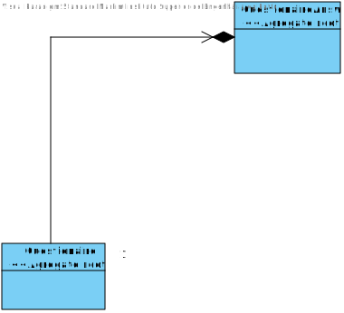
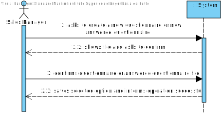
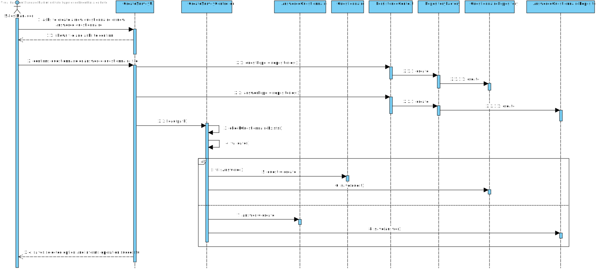
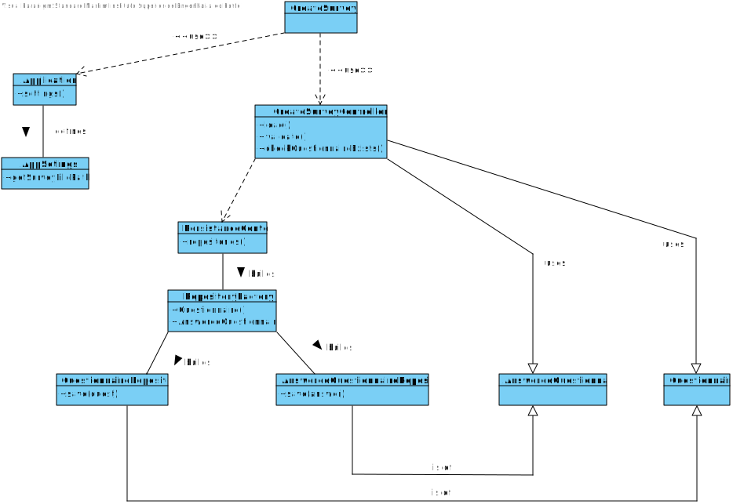

US3001
=======================================

# 1. Requisites

**As Sales Manager, I want to create a new questionnaire to be further answered by customers meeting the specified criteria (e.g.: have ordered a given product; belong to a given age group).**

Acceptance Criteria:
- The set of questions/answers composing the questionnaire should be expressed and validated (parsed) using the grammar being developed for this purpose.

Client Clarifications:

**Q1**:
- ***Q***: When creating a questionnaire should the user give a file with the questionnaire or write each question and section trough the command line? 
- ***A***: If the file is used, what is really important is the file content and not the file itself.

**Q2**:
- ***Q***: The same section can be present in more than one questionnaire?
  The same question can be present in more than one section?
- ***A***: Yes, that can happen. However, there is no intend to reutilize questions and/or sections. If that happens, the user will type the question/section again.

**Q3**:
- ***Q***: When a Section has a Question tagged as "Mandatory" should the section become "Mandatory" as well?
- ***A***: The question/answer is not straightforward. However, some consistency/coherence must exist/be assured between the "obligatoriness" of the section and of the question. You must also assure consistency with the "repeatability" information of the section.
Please, check carefully the example provided on section 5.1.3 of the specifications document where you can find "mandatory" sections (e.g.: section 1), "optional" sections (e.g.: section 8) and "condition dependent" sections (e.g.: section 3, 4 and 5). You can also find  "repeatable" sections (e.g.: section 6).
A "mandatory" or "condition dependant" section does not imply any "obligatoriness" on the questions.
An "optional" section implies that all questions are also "optional".
If a question is "mandatory", it means the user needs to answer such question no matter what is stated at the section it appears on.
If a question is "optional", it means that is up to the user to answer or not the question no matter what is stated at the section it appears on.
If a question is "condition dependent", it means the system needs to evaluate the associated condition to determine how to proceed, i.e. as "mandatory" or as "optional" question.

**Q4**:
- ***Q***: Can you specify what you mean when a Question/Section is tagged with "condition dependent" and the type of conditions to be set.
- ***A***: If the "obligatoriness" of a question/section is "condition dependent", it means it is "mandatory" when the associated condition evaluates as "true" and it is "optional" otherwise.

# 2. Analysis

## 2.1 Domain Diagram

This user story will be using the following Aggregates:

- Questionnaire
- AnsweredQuestionnaire

## 2.2 System Sequence Diagram

# 3. Design

## 3.1. Sequence Diagram

## 3.2. Class Diagram

## 3.3. Applied Patterns

For the realization of this user story the team used an OOP approach taking into the account of the use of a persistence context through JPA.
It's also given the use of Antlr 4.10, in order to test if the questionnaires will be accepted by the system

## 3.4. Tests

As the grammar takes care of checking if the questionnaire is valid, there was no need to develop tests for this US.

# 4. Implementation

**Class conformity** 

***CreateQuestionnaireController***

      public class CreateQuestionnaireController {
          public boolean load(String path) throws IOException {
          checkQuestionnaireExists();
  
          if(validate(path)) {
              String fileContent = Files.textFrom(new FileInputStream(path));
              if(isAnswered){
                  AnsweredQuestionnaire answeredQuestionnaire = new AnsweredQuestionnaire(fileContent);
                  return answeredQuestionnaireRepository.save(answeredQuestionnaire) != null;
              }else {
                  Questionnaire questionnaire = new Questionnaire(fileContent);
                  return questionnaireRepository.save(questionnaire) != null;
              }
          }
          return  false;
      }
  
      /**
       * Checks if Questionnaire is already registered in the system and deletes it before loading
       */
      private void checkQuestionnaireExists() {
          Iterator<Questionnaire> questionnaireIterator = questionnaireRepository.findAll().iterator();
  
          if (questionnaireIterator.hasNext())
              questionnaireRepository.delete(questionnaireIterator.next());
      }
  
      /**
       * validates the questionnaire or answered questionnaire
       * @param path the path to the file
       * @return true if it passes, false if don't
       * @throws IOException in case path file is not accepted
       */
      public boolean validate(String path) throws IOException {
          CharStream in = CharStreams.fromFileName(path);
          questionnairesLexer lexer = new questionnairesLexer(in);
          CommonTokenStream tokens = new CommonTokenStream(lexer);
          questionnairesParser parser = new questionnairesParser(tokens);
  
          questionnaireValidator validator = new questionnaireValidator();
  
          validator.visit(parser.questionnaires());
          isAnswered = validator.isAnsweredQuestionaire();
          return validator.validateAnswers();
      }
    }

***CreateSurveyUI***

    public class CreateSurveyUI extends AbstractUI {

      CreateQuestionnaireController controller = new CreateQuestionnaireController();
  
      @Override
      protected boolean doShow(){
          try{
              String jsonFileName = Application.settings().getSurveyFilePath();
              final String json = "Would you like to create survey from file " + jsonFileName + "? (Y/N)\n";
              if(Console.readBoolean(json)) {
                  if (this.controller.load(jsonFileName)) {
                      System.out.println("\nSurvey successfully loaded!\n");
                  } else {
                      System.out.println("\nUnable to create survey\n");
                  }
              }
          }catch (final IOException e) {
              System.out.println("Invalid survey file.");
          } catch (final Exception e) {
              System.out.println(e.getMessage());
          }
          return false;
      }
  
      @Override
      public String headline() {
          return "Create new Survey";
      }
    }

# 5. Integration/Demonstration

In order to integrate this US with the system at hand there was a need to create a class for Questionnaire and one for AnsweredQuestionnaire and persist them, in order to be able to use them either on server or memory
The UI was done in way that it can be easily implemented with other user should that need come.

# 6. Observations

N/A