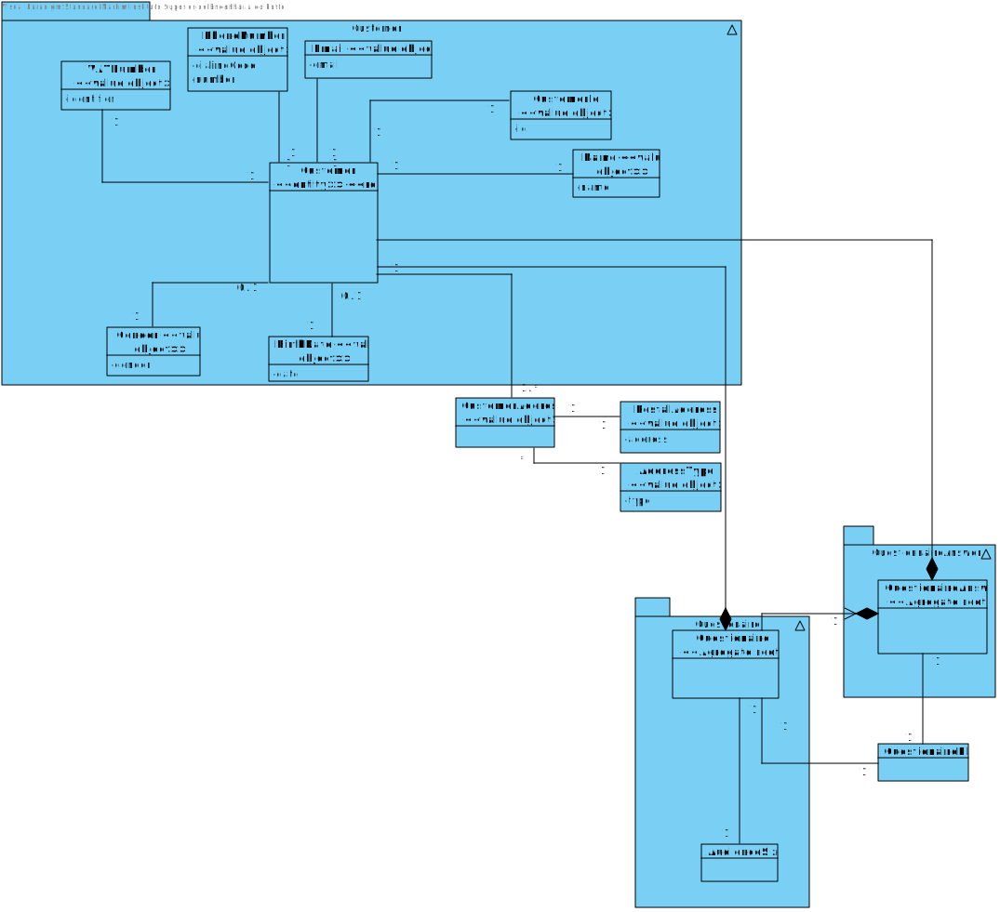
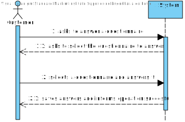
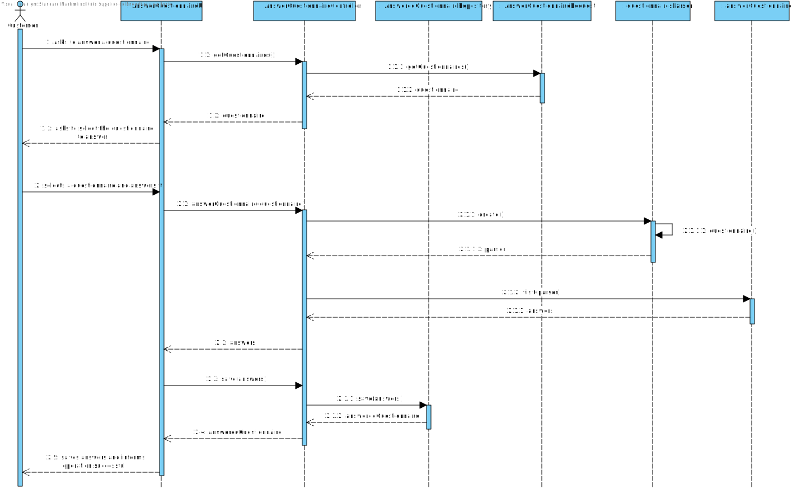
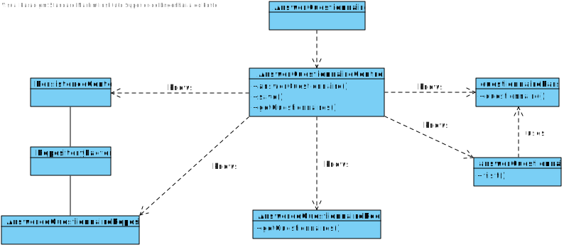

US3501
=======================================

# 1. Requisites

**As Customer, I want to get the list of questionnaires that the system is asking me to answer and be able to answer any of those questionnaires.**

Client Clarifications:

**Q1**:
- ***Q***: When the questionnaires appears, can there be an option to answer later? In case the customer doesn't want to answer at that specific time?
- ***A***: Regarding "an option to answer later", do not turn the easy things more complex than it is really needed.

**Q2**:
- ***Q***: In regard to the survey rules, can a survey have multiple of them? If multiple rules were chosen for a given survey, would these be used in conjunction or disjunction?
  Example: "Having ordered a certain product and be of a certain gender" or "Having ordered a certain product or be of a certain gender"
- ***A***: It would be nice to specify more than one condition in the same rule and have more than one rule.
**Example**:
***Rule 1*** (two conditions): "Having ordered a certain product (C1) and be of a certain gender (C2)".
***Rule 2*** (one condition): "Living in Porto district".
The target customers would be the ones meeting Rule 1 or Rule 2.
So, you have conjunction inside a rule (C1 and C2) and disjunction between rules (R1 or R2).
At the end of Sprint D, at least one scenario (conjunction or disjunction) must be supported.

**Q3**: 
- ***Q***: How should the surveys be distributed to the Customers? Should it be through the orders api?
- ***A***:  All communications must be in conformity with the Figure 2 content of the specifications' document. Be aware that the connection depicted on red must be avoid.

# 2. Analysis

## 2.1 Domain Diagram

This user story will be using the following Aggregates:

- Customer
- Questionnaire
- AnsweredQuestionnaire

## 2.2 System Sequence Diagram

# 3. Design

## 3.1. Sequence Diagram

## 3.2. Class Diagram

## 3.3. Applied Patterns

For the realization of this user story the team used an OOP approach taking into the account of the use of a persistence context through JPA.
It's also given the use of antlr 4.10, in order to be able to visit each section and question of the questionnaire

# 4. Implementation

**Class conformity**

***AnswerQuestionnaireController***

    public class AnswerQuestionnaireController {
        
        /**
         * Input stream to the remote server
         */
        private DataInputStream sIn;
    
        /**
         * Output stream to the remote server
         */
        private DataOutputStream sOut;
    
        /**
         * Authorization service that is used to make sure only authorized users can use the controller
         */
        private final AuthorizationService authz = AuthzRegistry.authorizationService();
    
        AnswerQuestionaireRequest answerQuestionaireRequest = new AnswerQuestionaireRequest(authz.session().get().authenticatedUser());
    
        /**
         * returns a list of al product categories
         * @return a list of al product categories
         */
        public List<Questionnaire> getQuestionnaires() {
            return answerQuestionaireRequest.getQuestionnaires();
        }
    
        public HashMap<String, HashMap<String, Pair<String, List<String>>>> answerQuestionnaire(Questionnaire questionnaire){
    
            CharStream in = CharStreams.fromString(questionnaire.text());
            questionnairesLexer lexer = new questionnairesLexer(in);
            CommonTokenStream tokens = new CommonTokenStream(lexer);
            questionnairesParser parser = new questionnairesParser(tokens);
    
            answerQuestionnaire validator = new answerQuestionnaire();
            validator.visit(parser.questionnaires());
    
            return validator.answers;
        }
    
        /**
         * Constructs a new ShowPreparedOrdersController
         */
        public AnswerQuestionnaireController() {
            authz.ensureAuthenticatedUserHasAnyOf(BaseRoles.CLIENT_USER, BaseRoles.ADMIN, BaseRoles.POWER_USER);
        }
    }

***AnswerQuestionnaireUI***
    
    public class AnswerQuestionnaireUI extends AbstractUI {
    
        /**
         * The UI's controller
         */
        private final AnswerQuestionnaireController theController = new AnswerQuestionnaireController();
    
        private final ShoppingCartPrinter printer = new ShoppingCartPrinter();
    
        @Override
        protected boolean doShow() {
    
            SelectWidget<Questionnaire> questionnaireSelectWidget = new SelectWidget<Questionnaire>("Select which survey you wish to answer", theController.getQuestionnaires());
            questionnaireSelectWidget.show();
            Questionnaire questionnaire = questionnaireSelectWidget.selectedElement();
            if(questionnaire != null) {
                HashMap<String, HashMap<String, Pair<String, List<String>>>> answers = theController.answerQuestionnaire(questionnaire);
            }
    
            return false;
        }
    
        @Override
        public String headline() {
            return "See Questionnaires - Customer \n";
        }
    }

***answerQuestionnaire***

    public class answerQuestionnaire extends questionnairesBaseVisitor<String> {
            
            @Override
            public String visitSection(questionnairesParser.SectionContext ctx) {
            sb = new StringBuilder();
            inSection = true;
    
            currentSection = ctx.section_id().sect_id.getText();
            jsonParser.jsonQuestionnaire().jsonSections().sectionID(Integer.parseInt(currentSection));
            sb.append("=================================================================================================================\n| Section ").append(currentSection).append(" - ");
    
    
            String sectionTitle = visitSection_title(ctx.section_title());
            jsonParser.jsonQuestionnaire().jsonSections().sectionTitle(sectionTitle);
    
            if(ctx.section_description() != null){
                String sectionDescription = visitSection_description(ctx.section_description());
                jsonParser.jsonQuestionnaire().jsonSections().sectionDescription(sectionDescription);
            }
    
            String sectionObligatoriness = visitSection_obligatoriness(ctx.section_obligatoriness());
            jsonParser.jsonQuestionnaire().jsonSections().obligatoriness(sectionObligatoriness);
    
            String sectionRepeatability = visitSection_repeatability(ctx.section_repeatability());
            jsonParser.jsonQuestionnaire().jsonSections().repeatability(sectionRepeatability);
    
            if(sectionObligatorinessConditionalRequisites() && sectionRepeatabilityConditionalRequisites() != 0) {
                System.out.println(sb);
            }
    
            if (!answers.containsKey(currentSection)) {
                HashMap<String, Pair<String, List<String>>> questionMap = new HashMap<>();
                answers.put(currentSection, questionMap);
            }
    
            
    
            inSection = false;
    
            return super.visitSection(ctx);
        }
    
        @Override
        public String visitSection_title(questionnairesParser.Section_titleContext ctx) {
    
            for (questionnairesParser.CharsContext string : ctx.text().chars())
                sb.append(string.getText()).append(" ");
            sb.delete(sb.length()-1, sb.length());
    
            return super.visitSection_title(ctx);
        }
    
        @Override
        public String visitSection_description(questionnairesParser.Section_descriptionContext ctx) {
            sb.append(": ");
    
            for (questionnairesParser.CharsContext string : ctx.text().chars())
                sb.append(string.getText()).append(" ");
            sb.delete(sb.length()-1, sb.length());
    
            return super.visitSection_description(ctx);
        }
    
        /**
         * Main method that will get the information from the question currently in
         */
        @Override
        public String visitQuestion(questionnairesParser.QuestionContext ctx) {
           if(sectionObligatorinessConditionalRequisites()) {
               for(int i = 0; i < sectionRepeatabilityConditionalRequisites();i++) {
                   sb = new StringBuilder();
                   if(this.sectionRepeatabilityFlag){
                       List<String> strings = this.answers.get(sectionRepeatabilityConditionSectionID).get(sectionRepeatabilityConditionQuestionID).b;
                       removeTraces(strings);
                       sb.append("| About the answer: " + strings.get(i) + "\n");
                   }
    
                       sb.append("=================================================================================================================\n");
                   visitQuestion_id(ctx.question_id());
                   visitQuestion_text(ctx.question_text());
                   if (ctx.question_instruction() != null) {
                       visitQuestion_instruction(ctx.question_instruction());
                   }
                   visitObligatoriness(ctx.obligatoriness());
    
                   if (this.questionMandatoriness.equals("\"condition dependent\"")) {
                       if (!questionConditionalRequisites()) return super.visitQuestion(ctx);
                   }
                   visitQuestion_type(ctx.question_type());
    
                   System.out.println(sb);
                   validateAnswer();
               }
           }
            return super.visitQuestion(ctx);
        }
    
        /**
         * Visits the question ID and saves it.
         */
        @Override
        public String visitQuestion_id(questionnairesParser.Question_idContext ctx) {
    
            if(!inSection){
                this.currentQuestion = ctx.quest_id.getText();
                sb.append("Question ").append(currentQuestion).append(" - ");
            }
            return super.visitQuestion_id(ctx);
        }
    
        /**
         * Visits the question text and saves it.
         */
        @Override
        public String visitQuestion_text(questionnairesParser.Question_textContext ctx) {
            for (questionnairesParser.CharsContext asd : ctx.text().chars())
                sb.append(asd.getText()).append(" ");
            sb.append("\n");
            return super.visitQuestion_text(ctx);
        }
    }

# 5. Integration/Demonstration

There was 2 possible ways to do the validation on this US:
***Validation in Real Time***:
In this validation type, every time an answer is given, they are validated right after.

This way takes more work as the validation after the questionnaire is done was implemented on the past sprint. Contrarily, LRPOG's teacher shown a preference to this method.

***Validation after Questionnaire is Fully Done***:

On this approach, after the questionnaire is fully done, the user can answer it, once it's completed the answers will be validated. 
Besides this approach being already implemented, it isn't very inviting to use, as it forces the user the fully complete the questionnaire again in case it fails somewhere.

***Chosen Path***:
After discussion with the team members, we chose the "Validation in Real Time" approach.

The way it's currently implemented the user is able to fully answer a questionnaire, depending on his choices, some questions might appear or not,
as per indicated by the client.

# 6. Observations

N/A